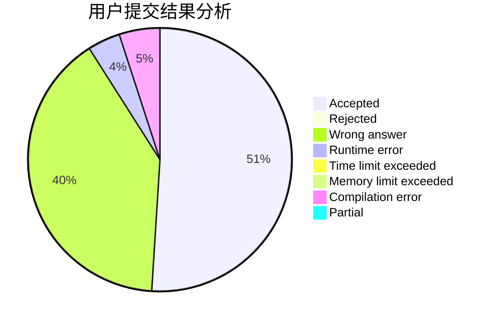
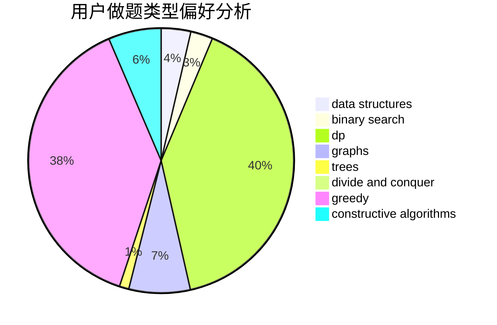
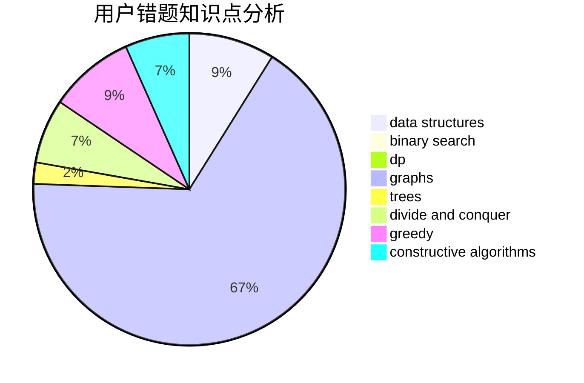

# lcj_rating1600

<!-- tabs:start -->

#### **用户提交结果分析**

#### **用户做题类型偏好分析**

#### **用户错题知识点分析**

<!-- tabs:end -->
# 推荐题目
[1025C](https://codeforces.com/contest/1025/problem/C)		constructive algorithms,
                        implementation		  
[318C](https://codeforces.com/contest/318/problem/C)		dsu,graphs,sortings,trees		  
[12371](https://codeforces.com/contest/1237/problem/1)		dsu,graphs,sortings,trees		  
[1099F](https://codeforces.com/contest/1099/problem/F)		binary search,
                        data structures,
                        dfs and similar,
                        dp,
                        games,
                        trees		  
[327A](https://codeforces.com/contest/327/problem/A)		brute force,
                        dp,
                        implementation		  
[1346C](https://codeforces.com/contest/1346/problem/C)		*special problem,
                        greedy,
                        sortings		  
[1043A](https://codeforces.com/contest/1043/problem/A)		implementation,
                        math		  
[869D](https://codeforces.com/contest/869/problem/D)		brute force,
                        dfs and similar,
                        graphs		  
[1099D](https://codeforces.com/contest/1099/problem/D)		dsu,graphs,sortings,trees		  
[712C](https://codeforces.com/contest/712/problem/C)		greedy,
                        math		  
