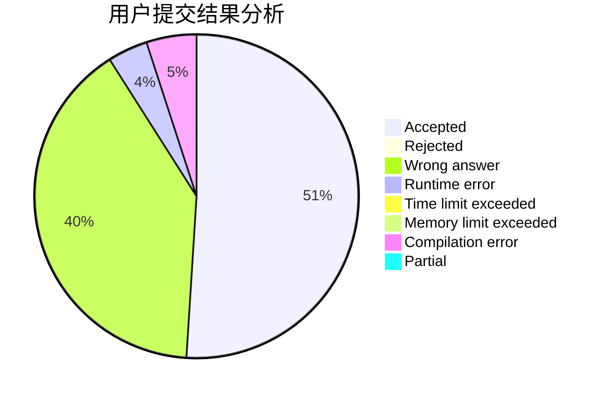
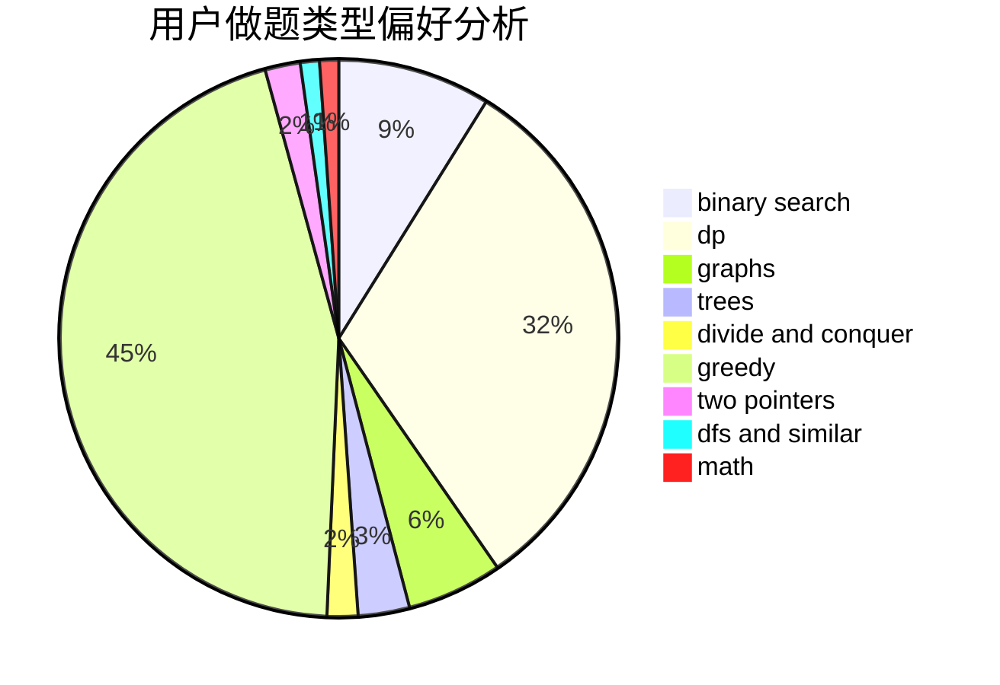

# lcj_rating1600

<!-- tabs:start -->

#### **用户提交结果分析**

#### **用户做题类型偏好分析**

<!-- tabs:end -->
# 推荐题目
[1025C](https://codeforces.com/contest/1025/problem/C)
[318C](https://codeforces.com/contest/318/problem/C)
[12371](https://codeforces.com/contest/1237/problem/1)
[1099F](https://codeforces.com/contest/1099/problem/F)
[327A](https://codeforces.com/contest/327/problem/A)
[1346C](https://codeforces.com/contest/1346/problem/C)
[1043A](https://codeforces.com/contest/1043/problem/A)
[869D](https://codeforces.com/contest/869/problem/D)
[1099D](https://codeforces.com/contest/1099/problem/D)
[712C](https://codeforces.com/contest/712/problem/C)
