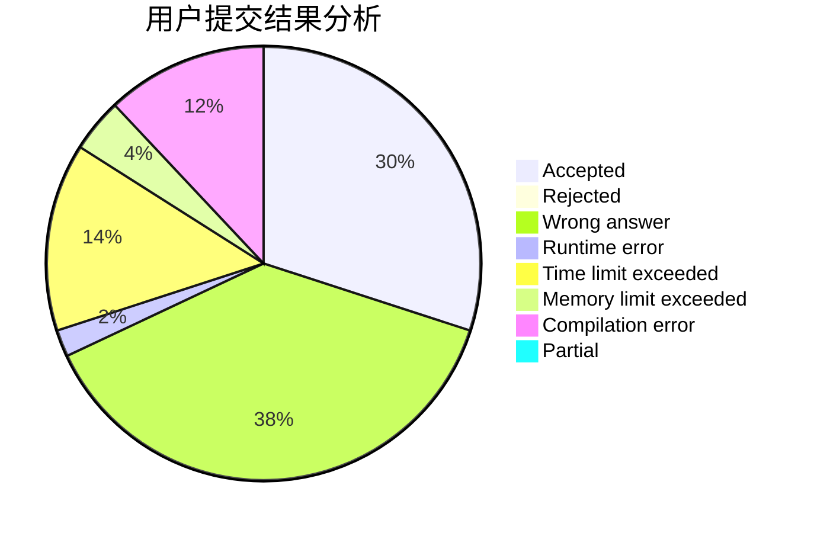
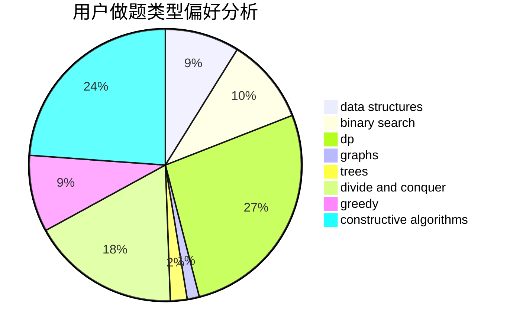
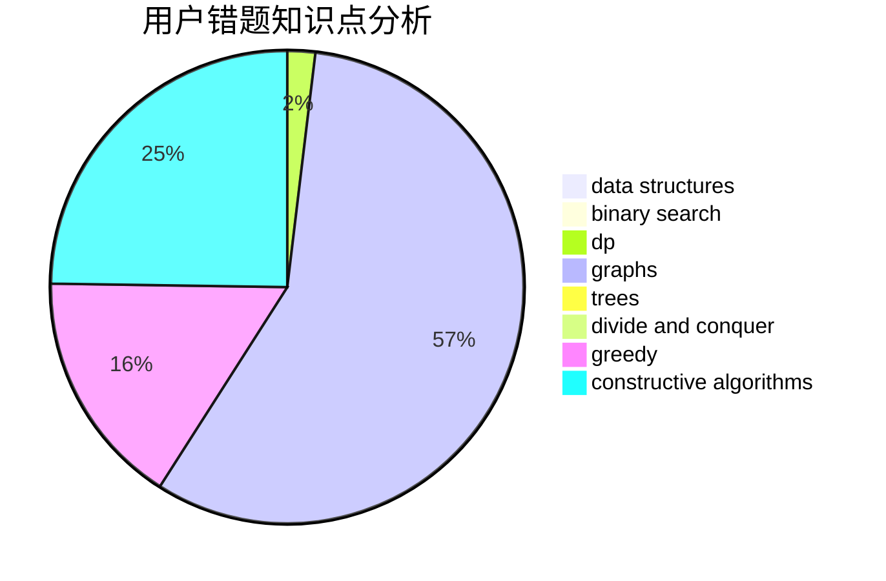

# lcl12345

<!-- tabs:start -->

#### **用户提交结果分析**

#### **用户做题类型偏好分析**

#### **用户错题知识点分析**

<!-- tabs:end -->
# 推荐题目
[1354G](https://codeforces.com/contest/1354/problem/G)		binary search,
                        interactive,
                        probabilities		  
[1402B](https://codeforces.com/contest/1402/problem/B)		*special problem,
                        geometry,
                        sortings		  
[1038A](https://codeforces.com/contest/1038/problem/A)		implementation,
                        strings		  
[627C](https://codeforces.com/contest/627/problem/C)		data structures,
                        divide and conquer,
                        greedy		  
[683A](https://codeforces.com/contest/683/problem/A)		*special problem,
                        geometry		  
[1157D](https://codeforces.com/contest/1157/problem/D)		constructive algorithms,
                        greedy,
                        math		  
[736D](https://codeforces.com/contest/736/problem/D)		math,
                        matrices		  
[909E](https://codeforces.com/contest/909/problem/E)		dfs and similar,
                        dp,
                        graphs,
                        greedy		  
[412D](https://codeforces.com/contest/412/problem/D)		dfs and similar		  
[1059B](https://codeforces.com/contest/1059/problem/B)		implementation		  
