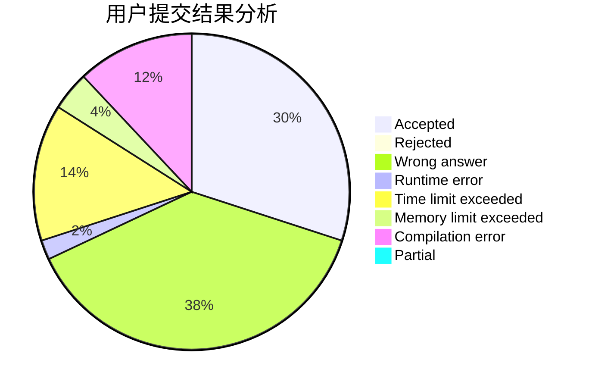
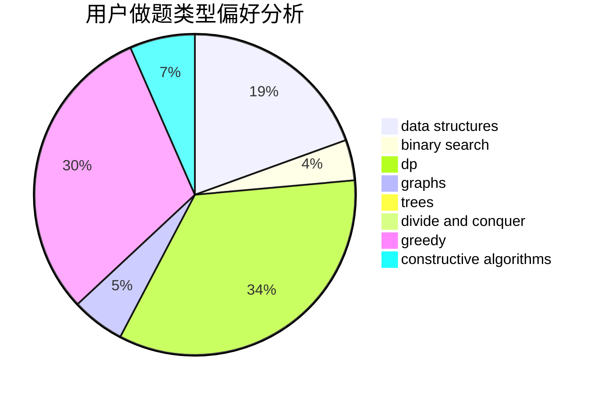
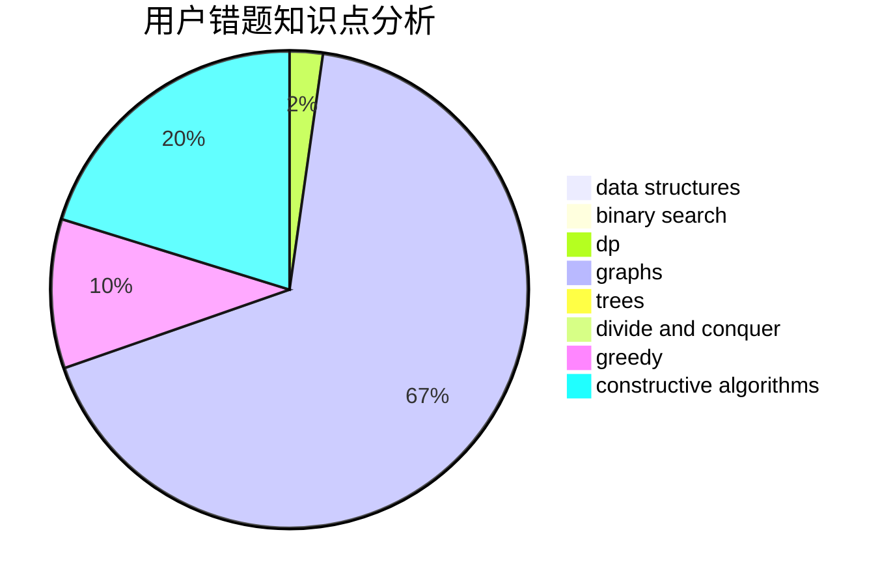

# lcl12345

<!-- tabs:start -->

#### **用户提交结果分析**

#### **用户做题类型偏好分析**

#### **用户错题知识点分析**

<!-- tabs:end -->
# 推荐题目
[1361D](https://codeforces.com/contest/1361/problem/D)		greedy,
                        implementation,
                        math,
                        trees		  
[1413D](https://codeforces.com/contest/1413/problem/D)		data structures,
                        greedy,
                        implementation		  
[1038D](https://codeforces.com/contest/1038/problem/D)		dp,
                        greedy,
                        implementation		  
[653C](https://codeforces.com/contest/653/problem/C)		brute force,
                        implementation		  
[707B](https://codeforces.com/contest/707/problem/B)		graphs		  
[1159F](https://codeforces.com/contest/1159/problem/F)		dsu,graphs,sortings,trees		  
[758B](https://codeforces.com/contest/758/problem/B)		brute force,
                        implementation,
                        number theory		  
[924C](https://codeforces.com/contest/924/problem/C)		data structures,
                        dp,
                        greedy		  
[438C](https://codeforces.com/contest/438/problem/C)		dsu,graphs,sortings,trees		  
[1059E](https://codeforces.com/contest/1059/problem/E)		binary search,
                        data structures,
                        dp,
                        greedy,
                        trees		  
