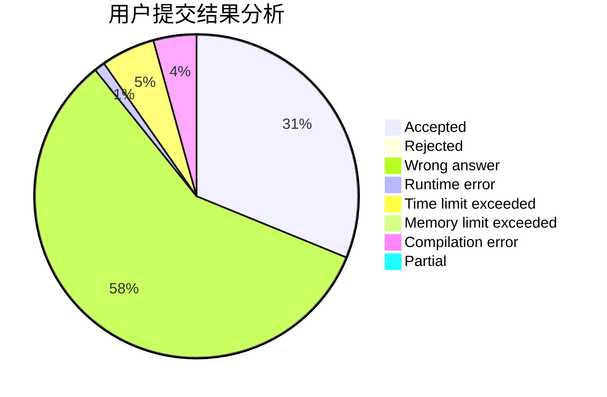
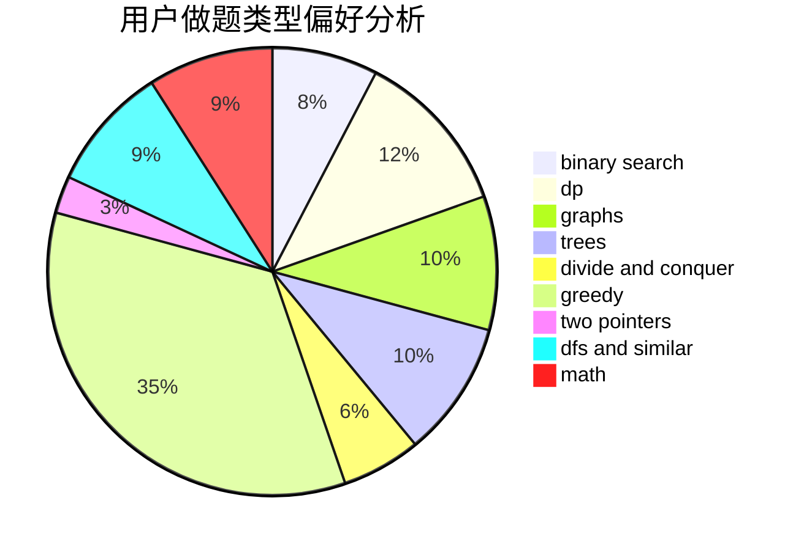

# lcsdsg

<!-- tabs:start -->

#### **用户提交结果分析**

#### **用户做题类型偏好分析**

<!-- tabs:end -->
# 推荐题目
[691C](https://codeforces.com/contest/691/problem/C)
[682D](https://codeforces.com/contest/682/problem/D)
[190C](https://codeforces.com/contest/190/problem/C)
[949A](https://codeforces.com/contest/949/problem/A)
[986A](https://codeforces.com/contest/986/problem/A)
[11521](https://codeforces.com/contest/1152/problem/1)
[731B](https://codeforces.com/contest/731/problem/B)
[13701](https://codeforces.com/contest/1370/problem/1)
[820D](https://codeforces.com/contest/820/problem/D)
[1145D](https://codeforces.com/contest/1145/problem/D)
