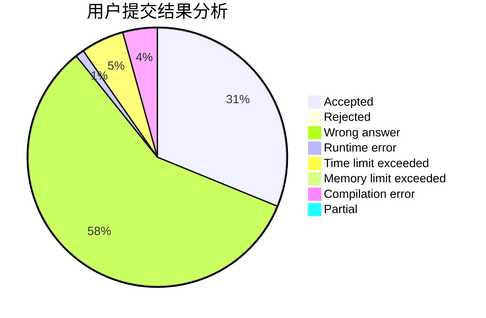
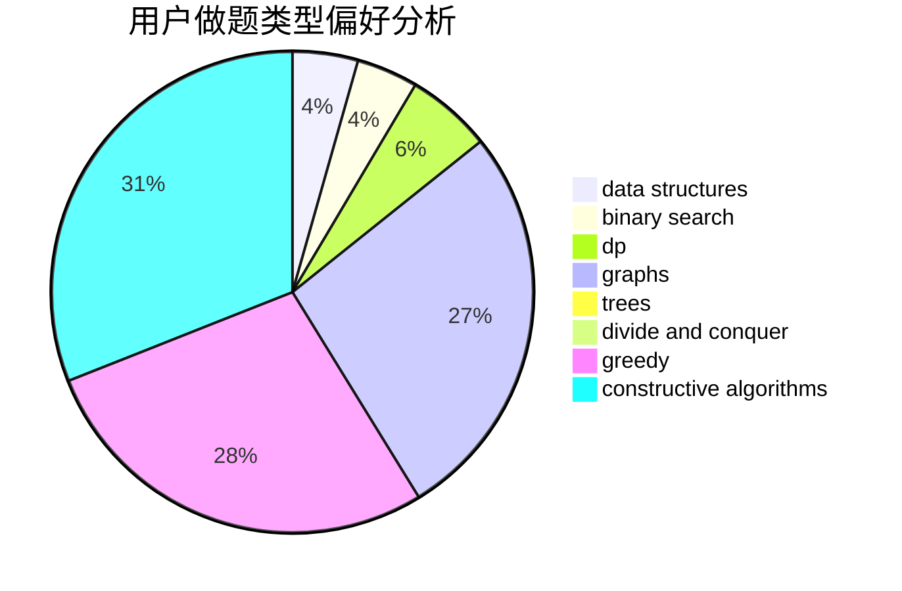

# lcsdsg

<!-- tabs:start -->

#### **用户提交结果分析**

#### **用户做题类型偏好分析**

#### **用户错题知识点分析**

<!-- tabs:end -->
# 推荐题目
[669C](https://codeforces.com/contest/669/problem/C)		dsu,graphs,sortings,trees		  
[662D](https://codeforces.com/contest/662/problem/D)		constructive algorithms,
                        greedy,
                        implementation,
                        math		  
[165D](https://codeforces.com/contest/165/problem/D)		data structures,
                        dsu,
                        trees		  
[925C](https://codeforces.com/contest/925/problem/C)		constructive algorithms,
                        math		  
[963C](https://codeforces.com/contest/963/problem/C)		brute force,
                        math,
                        number theory		  
[114D](https://codeforces.com/contest/114/problem/D)		dsu,graphs,sortings,trees		  
[711B](https://codeforces.com/contest/711/problem/B)		constructive algorithms,
                        implementation		  
[1362F](https://codeforces.com/contest/1362/problem/F)		dsu,graphs,sortings,trees		  
[804E](https://codeforces.com/contest/804/problem/E)		constructive algorithms		  
[1143D](https://codeforces.com/contest/1143/problem/D)		dsu,graphs,sortings,trees		  
