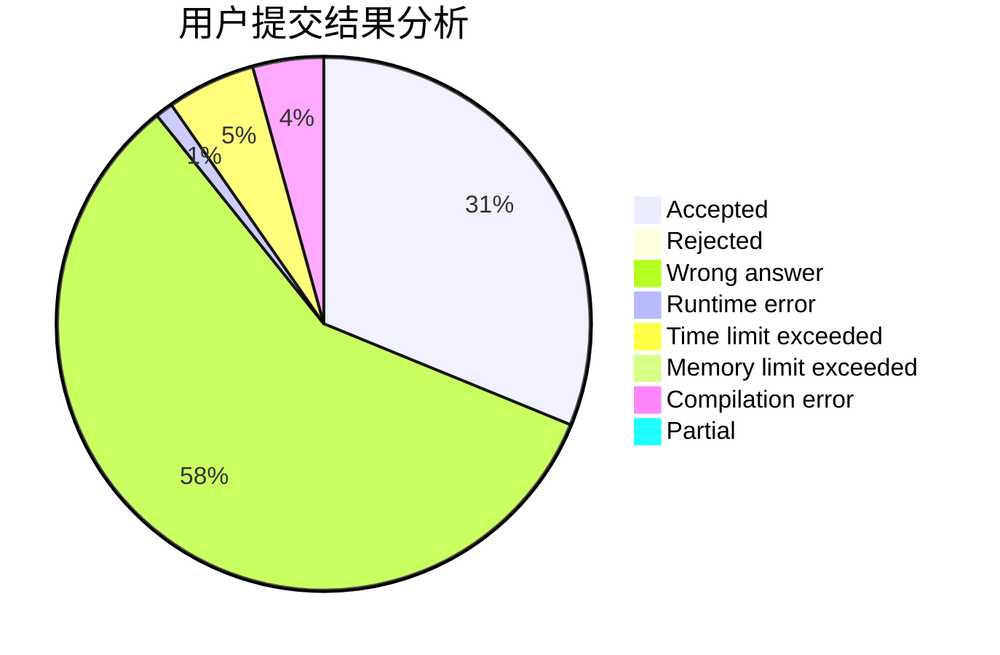
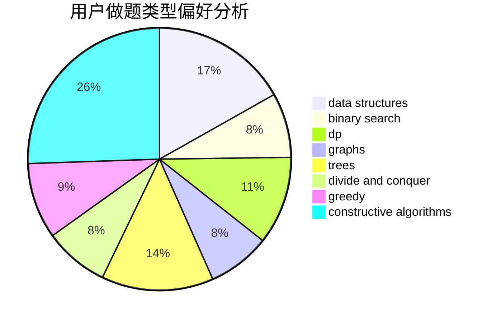

# lcsdsg

<!-- tabs:start -->

#### **用户提交结果分析**

#### **用户做题类型偏好分析**

#### **用户错题知识点分析**

<!-- tabs:end -->
# 推荐题目
[691C](https://codeforces.com/contest/691/problem/C)		implementation,
                        strings		  
[682D](https://codeforces.com/contest/682/problem/D)		dp,
                        strings		  
[190C](https://codeforces.com/contest/190/problem/C)		dfs and similar		  
[949A](https://codeforces.com/contest/949/problem/A)		greedy		  
[986A](https://codeforces.com/contest/986/problem/A)		graphs,
                        greedy,
                        number theory,
                        shortest paths		  
[11521](https://codeforces.com/contest/1152/problem/1)		dsu,graphs,sortings,trees		  
[731B](https://codeforces.com/contest/731/problem/B)		constructive algorithms,
                        greedy		  
[13701](https://codeforces.com/contest/1370/problem/1)		dsu,graphs,sortings,trees		  
[820D](https://codeforces.com/contest/820/problem/D)		dsu,graphs,sortings,trees		  
[1145D](https://codeforces.com/contest/1145/problem/D)		implementation		  
