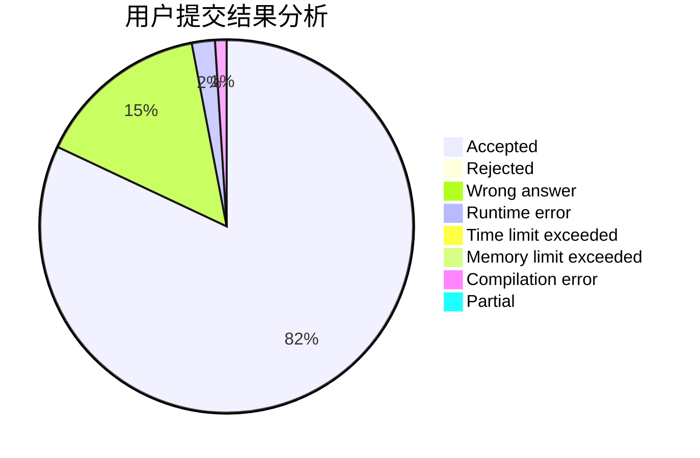
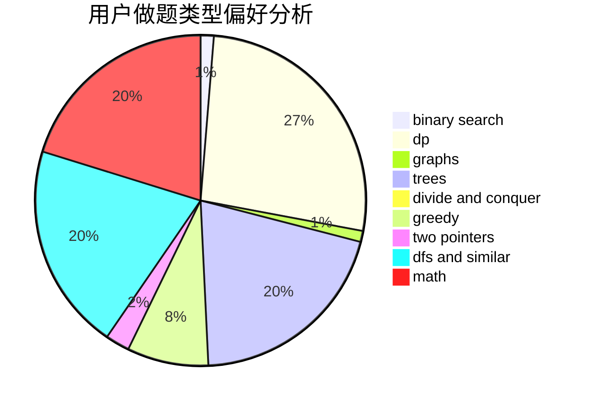

# leapfrog

<!-- tabs:start -->

#### **用户提交结果分析**

#### **用户做题类型偏好分析**

<!-- tabs:end -->
# 推荐题目
[1423I](https://codeforces.com/contest/1423/problem/I)
[696B](https://codeforces.com/contest/696/problem/B)
[607E](https://codeforces.com/contest/607/problem/E)
[736C](https://codeforces.com/contest/736/problem/C)
[917A](https://codeforces.com/contest/917/problem/A)
[273E](https://codeforces.com/contest/273/problem/E)
[1332D](https://codeforces.com/contest/1332/problem/D)
[789A](https://codeforces.com/contest/789/problem/A)
[730H](https://codeforces.com/contest/730/problem/H)
[855G](https://codeforces.com/contest/855/problem/G)
