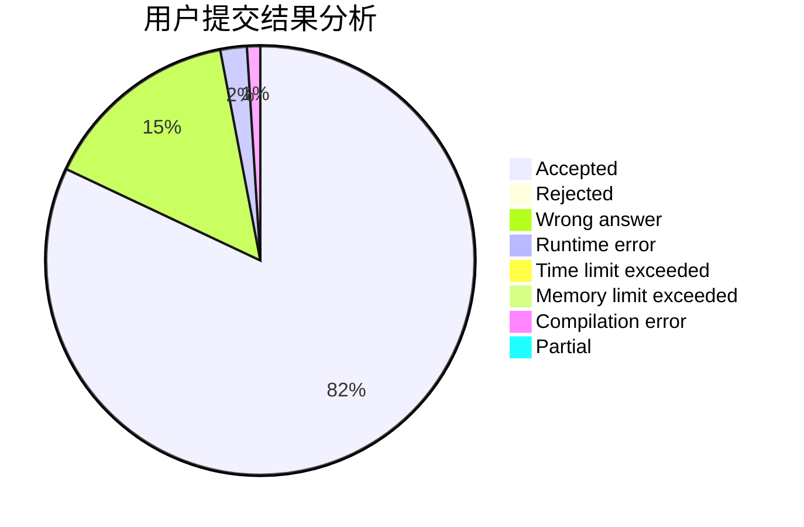
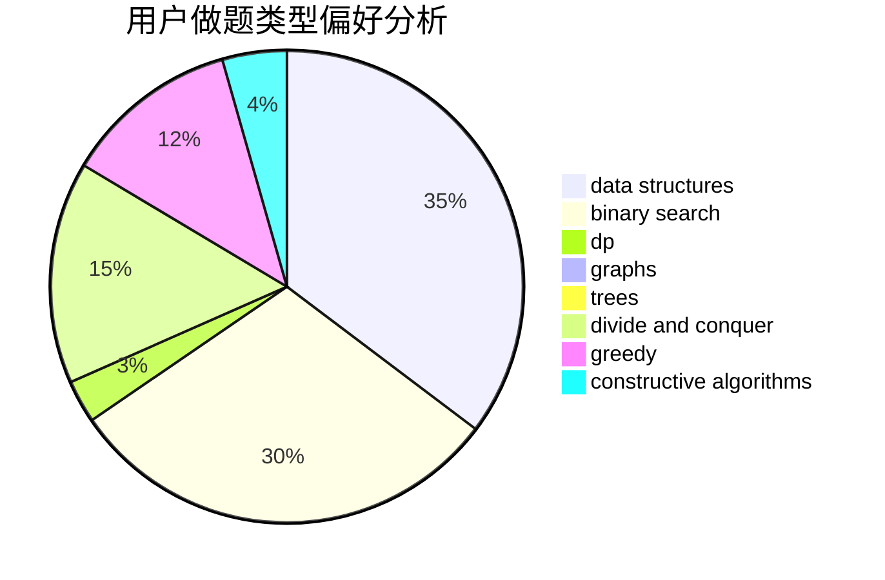

# leapfrog

<!-- tabs:start -->

#### **用户提交结果分析**

#### **用户做题类型偏好分析**

#### **用户错题知识点分析**

<!-- tabs:end -->
# 推荐题目
[1415E](https://codeforces.com/contest/1415/problem/E)		constructive algorithms,
                        greedy,
                        math		  
[670D1](https://codeforces.com/contest/670D/problem/1)		binary search,
                        brute force,
                        implementation		  
[587D](https://codeforces.com/contest/587/problem/D)		2-sat,
                        binary search		  
[719B](https://codeforces.com/contest/719/problem/B)		greedy		  
[900C](https://codeforces.com/contest/900/problem/C)		brute force,
                        data structures,
                        math		  
[255C](https://codeforces.com/contest/255/problem/C)		brute force,
                        dp		  
[1326B](https://codeforces.com/contest/1326/problem/B)		implementation,
                        math		  
[769A](https://codeforces.com/contest/769/problem/A)		*special problem,
                        implementation,
                        sortings		  
[710D](https://codeforces.com/contest/710/problem/D)		math,
                        number theory		  
[838B](https://codeforces.com/contest/838/problem/B)		data structures,
                        dfs and similar,
                        trees		  
