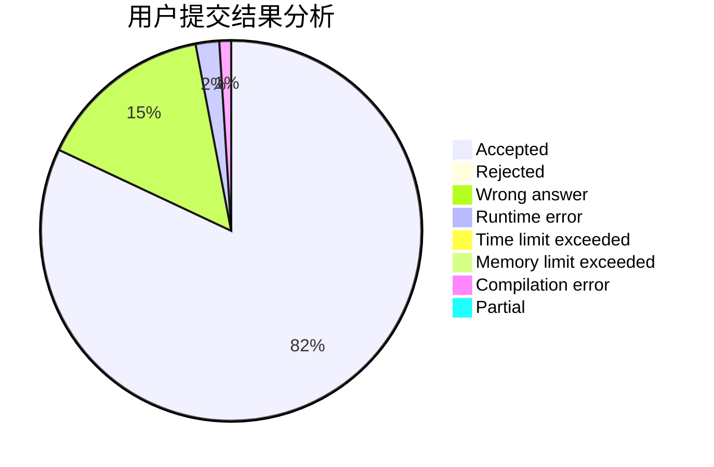
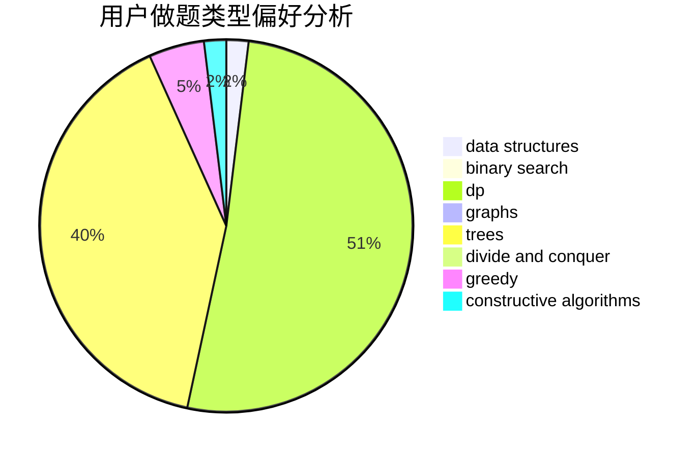

# leapfrog

<!-- tabs:start -->

#### **用户提交结果分析**

#### **用户做题类型偏好分析**

#### **用户错题知识点分析**

<!-- tabs:end -->
# 推荐题目
[1423I](https://codeforces.com/contest/1423/problem/I)		bitmasks		  
[696B](https://codeforces.com/contest/696/problem/B)		dfs and similar,
                        math,
                        probabilities,
                        trees		  
[607E](https://codeforces.com/contest/607/problem/E)		binary search,
                        geometry		  
[736C](https://codeforces.com/contest/736/problem/C)		dsu,graphs,sortings,trees		  
[917A](https://codeforces.com/contest/917/problem/A)		dp,
                        greedy,
                        implementation,
                        math		  
[273E](https://codeforces.com/contest/273/problem/E)		dp,
                        games		  
[1332D](https://codeforces.com/contest/1332/problem/D)		bitmasks,
                        constructive algorithms,
                        math		  
[789A](https://codeforces.com/contest/789/problem/A)		implementation,
                        math		  
[730H](https://codeforces.com/contest/730/problem/H)		constructive algorithms,
                        implementation		  
[855G](https://codeforces.com/contest/855/problem/G)		dfs and similar,
                        dp,
                        graphs,
                        trees		  
