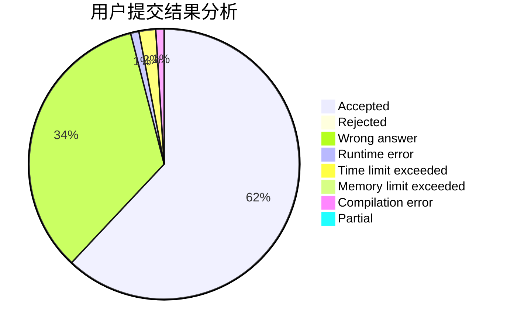
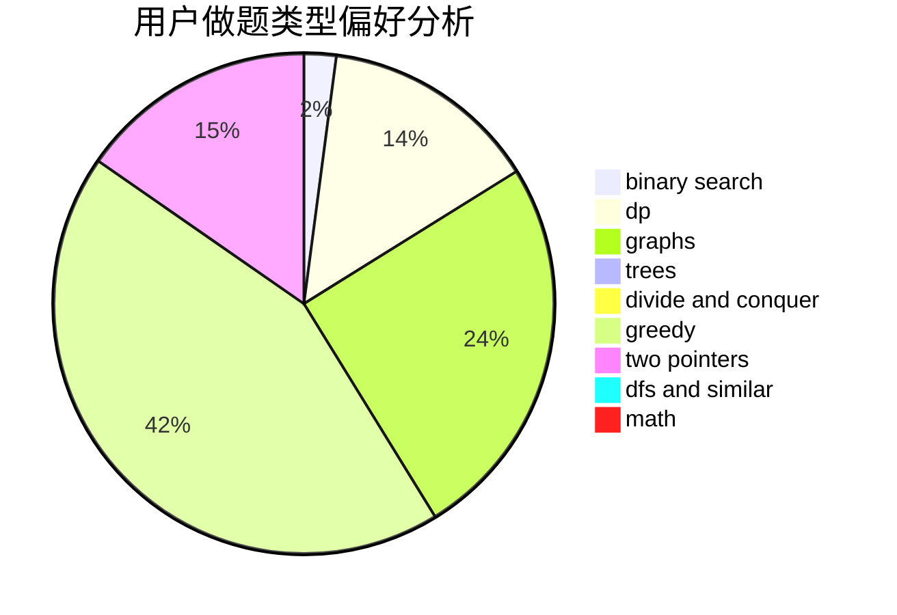

# Biadocy

<!-- tabs:start -->

#### **用户提交结果分析**

#### **用户做题类型偏好分析**

<!-- tabs:end -->
# 推荐题目
[1505C](https://codeforces.com/contest/1505/problem/C)
[551B](https://codeforces.com/contest/551/problem/B)
[551C](https://codeforces.com/contest/551/problem/C)
[551A](https://codeforces.com/contest/551/problem/A)
[550A](https://codeforces.com/contest/550/problem/A)
[550B](https://codeforces.com/contest/550/problem/B)
[54A](https://codeforces.com/contest/54/problem/A)
[54B](https://codeforces.com/contest/54/problem/B)
[550D](https://codeforces.com/contest/550/problem/D)
[550C](https://codeforces.com/contest/550/problem/C)
