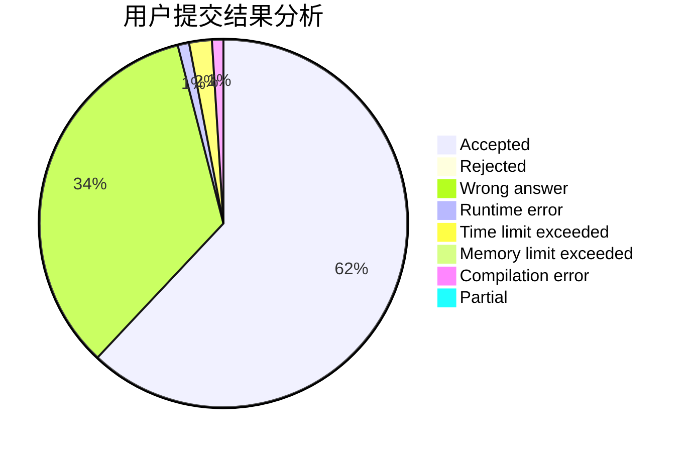
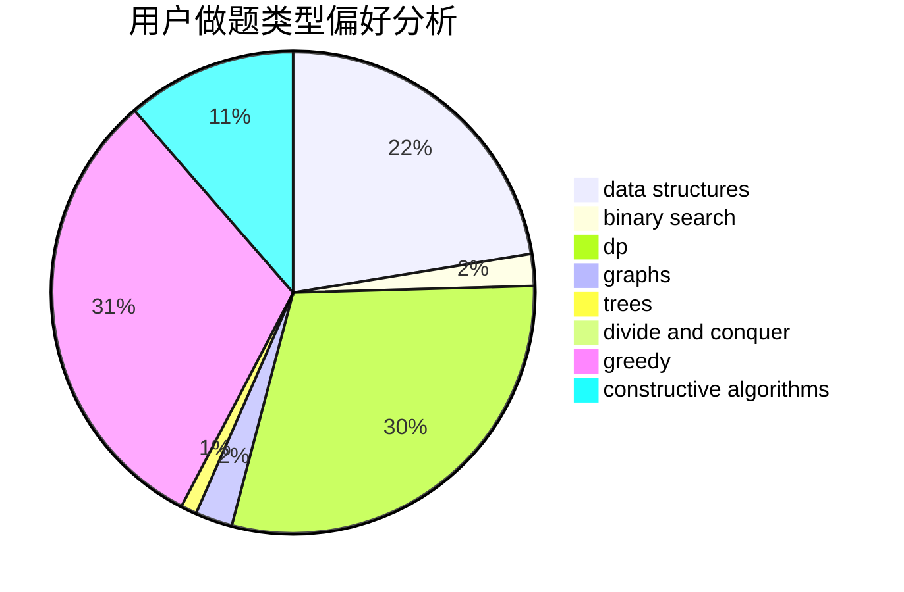
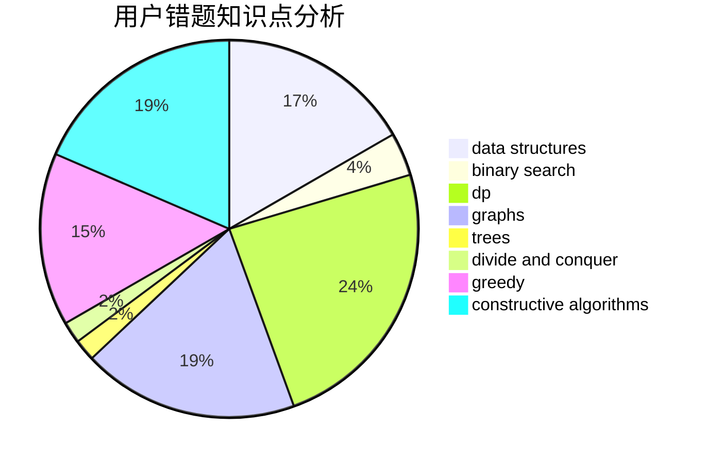

# Biadocy

<!-- tabs:start -->

#### **用户提交结果分析**

#### **用户做题类型偏好分析**

#### **用户错题知识点分析**

<!-- tabs:end -->
# 推荐题目
[1505C](https://codeforces.com/contest/1505/problem/C)		implementation		  
[551B](https://codeforces.com/contest/551/problem/B)		brute force,
                        constructive algorithms,
                        implementation,
                        strings		  
[551C](https://codeforces.com/contest/551/problem/C)		binary search,
                        greedy		  
[551A](https://codeforces.com/contest/551/problem/A)		brute force,
                        implementation,
                        sortings		  
[550A](https://codeforces.com/contest/550/problem/A)		brute force,
                        dp,
                        greedy,
                        implementation,
                        strings		  
[550B](https://codeforces.com/contest/550/problem/B)		bitmasks,
                        brute force		  
[54A](https://codeforces.com/contest/54/problem/A)		implementation		  
[54B](https://codeforces.com/contest/54/problem/B)		hashing,
                        implementation		  
[550D](https://codeforces.com/contest/550/problem/D)		constructive algorithms,
                        graphs,
                        implementation		  
[550C](https://codeforces.com/contest/550/problem/C)		brute force,
                        dp,
                        math		  
