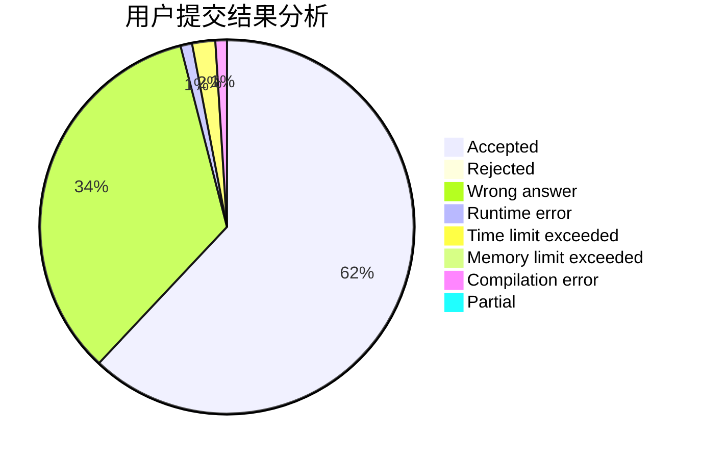
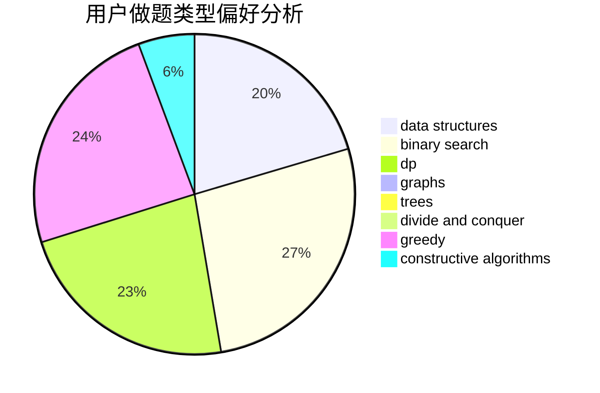
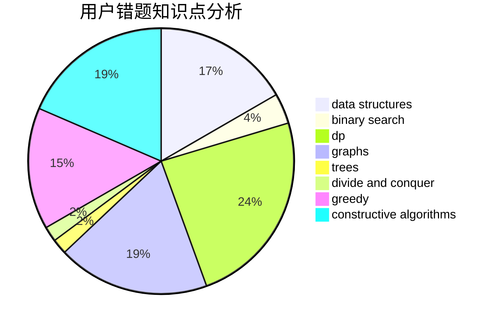

# Biadocy

<!-- tabs:start -->

#### **用户提交结果分析**

#### **用户做题类型偏好分析**

#### **用户错题知识点分析**

<!-- tabs:end -->
# 推荐题目
[1496C](https://codeforces.com/contest/1496/problem/C)		dsu,graphs,sortings,trees		  
[527B](https://codeforces.com/contest/527/problem/B)		greedy		  
[527C](https://codeforces.com/contest/527/problem/C)		binary search,
                        data structures,
                        implementation		  
[526G](https://codeforces.com/contest/526/problem/G)		greedy,
                        trees		  
[526A](https://codeforces.com/contest/526/problem/A)		brute force,
                        implementation		  
[526B](https://codeforces.com/contest/526/problem/B)		dfs and similar,
                        greedy,
                        implementation		  
[525D](https://codeforces.com/contest/525/problem/D)		constructive algorithms,
                        data structures,
                        graphs,
                        greedy,
                        shortest paths		  
[525E](https://codeforces.com/contest/525/problem/E)		binary search,
                        bitmasks,
                        brute force,
                        dp,
                        math,
                        meet-in-the-middle		  
[526E](https://codeforces.com/contest/526/problem/E)		dp,
                        implementation		  
[526D](https://codeforces.com/contest/526/problem/D)		hashing,
                        string suffix structures,
                        strings		  
