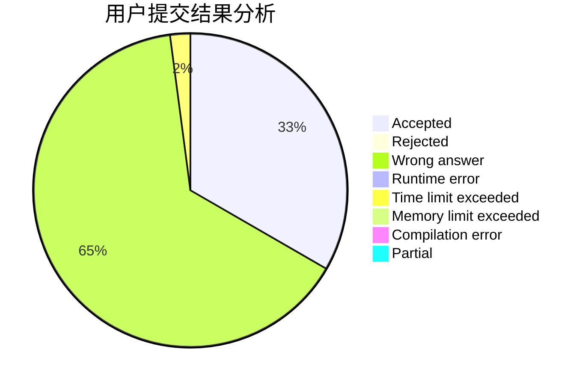
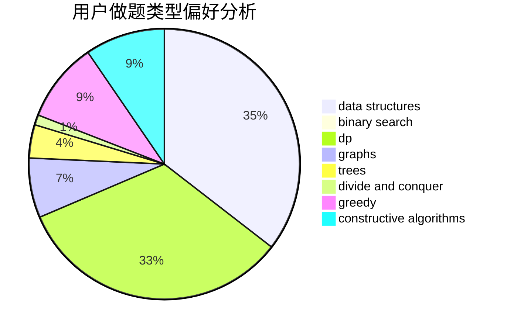

# lemonaaaaa

<!-- tabs:start -->

#### **用户提交结果分析**

#### **用户做题类型偏好分析**

#### **用户错题知识点分析**

<!-- tabs:end -->
# 推荐题目
[14461](https://codeforces.com/contest/1446/problem/1)		dsu,graphs,sortings,trees		  
[1323C](https://codeforces.com/contest/1323/problem/C)		dsu,graphs,sortings,trees		  
[683B](https://codeforces.com/contest/683/problem/B)		*special problem		  
[266B](https://codeforces.com/contest/266/problem/B)		constructive algorithms,
                        graph matchings,
                        implementation,
                        shortest paths		  
[724C](https://codeforces.com/contest/724/problem/C)		greedy,
                        hashing,
                        implementation,
                        math,
                        number theory,
                        sortings		  
[1059B](https://codeforces.com/contest/1059/problem/B)		implementation		  
[678B](https://codeforces.com/contest/678/problem/B)		implementation		  
[1341F](https://codeforces.com/contest/1341/problem/F)		dsu,graphs,sortings,trees		  
[451A](https://codeforces.com/contest/451/problem/A)		implementation		  
[586F](https://codeforces.com/contest/586/problem/F)		dsu,graphs,sortings,trees		  
