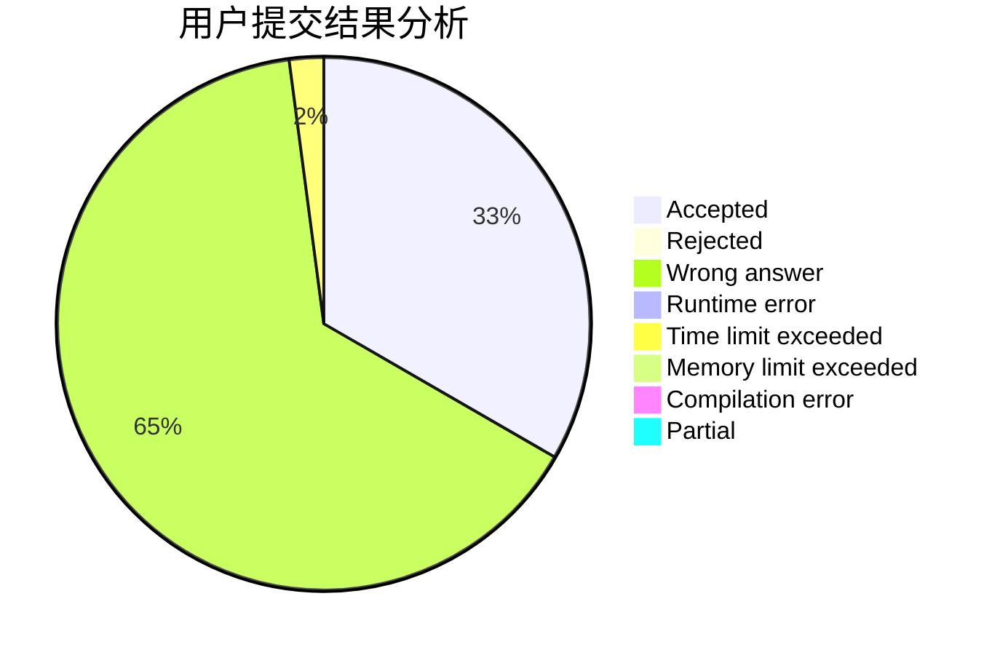
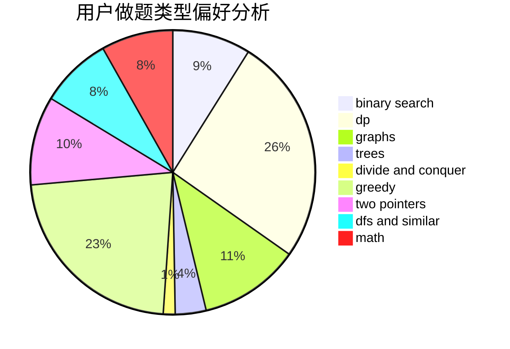

# lemonaaaaa

<!-- tabs:start -->

#### **用户提交结果分析**

#### **用户做题类型偏好分析**

<!-- tabs:end -->
# 推荐题目
[14461](https://codeforces.com/contest/1446/problem/1)
[1323C](https://codeforces.com/contest/1323/problem/C)
[683B](https://codeforces.com/contest/683/problem/B)
[266B](https://codeforces.com/contest/266/problem/B)
[724C](https://codeforces.com/contest/724/problem/C)
[1059B](https://codeforces.com/contest/1059/problem/B)
[678B](https://codeforces.com/contest/678/problem/B)
[1341F](https://codeforces.com/contest/1341/problem/F)
[451A](https://codeforces.com/contest/451/problem/A)
[586F](https://codeforces.com/contest/586/problem/F)
