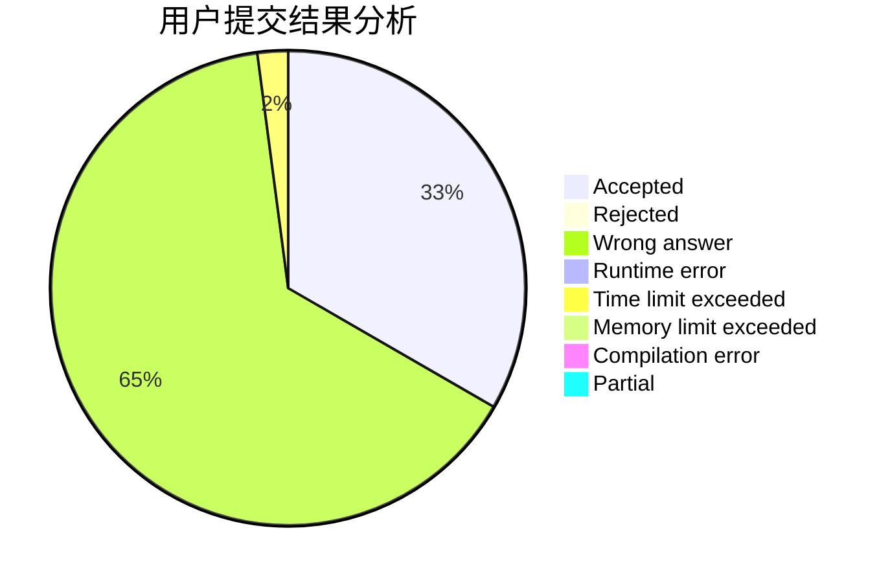
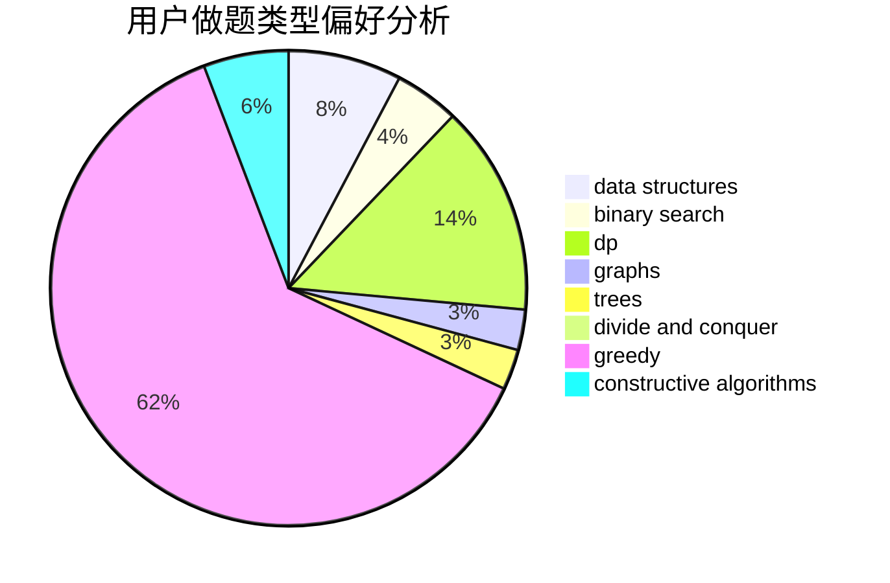

# lemonaaaaa

<!-- tabs:start -->

#### **用户提交结果分析**

#### **用户做题类型偏好分析**

#### **用户错题知识点分析**

<!-- tabs:end -->
# 推荐题目
[1436A](https://codeforces.com/contest/1436/problem/A)		math		  
[1313E](https://codeforces.com/contest/1313/problem/E)		data structures,
                        hashing,
                        strings,
                        two pointers		  
[664A](https://codeforces.com/contest/664/problem/A)		math,
                        number theory		  
[245H](https://codeforces.com/contest/245/problem/H)		dp,
                        hashing,
                        strings		  
[705B](https://codeforces.com/contest/705/problem/B)		games,
                        math		  
[1058D](https://codeforces.com/contest/1058/problem/D)		dsu,graphs,sortings,trees		  
[653F](https://codeforces.com/contest/653/problem/F)		data structures,
                        string suffix structures,
                        strings		  
[1334G](https://codeforces.com/contest/1334/problem/G)		bitmasks,
                        brute force,
                        fft		  
[429E](https://codeforces.com/contest/429/problem/E)		graphs		  
[567B](https://codeforces.com/contest/567/problem/B)		implementation		  
