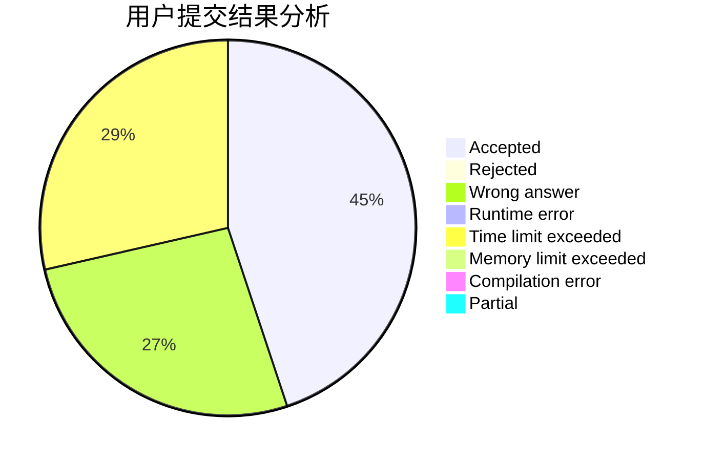
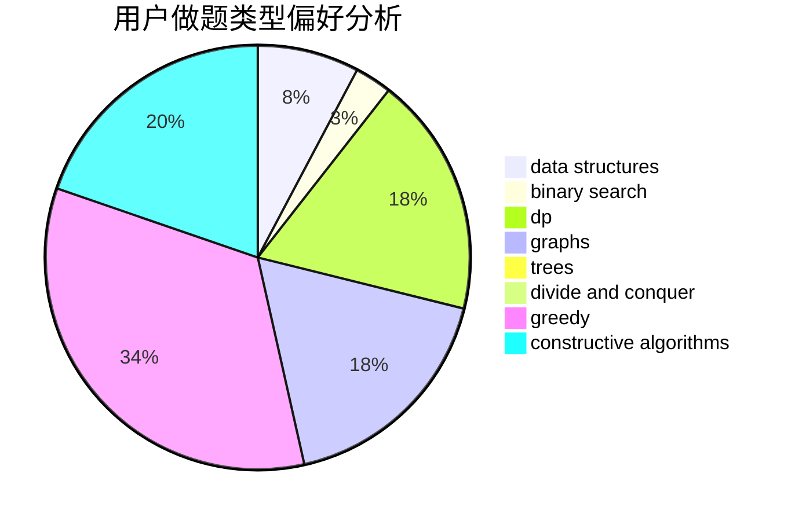
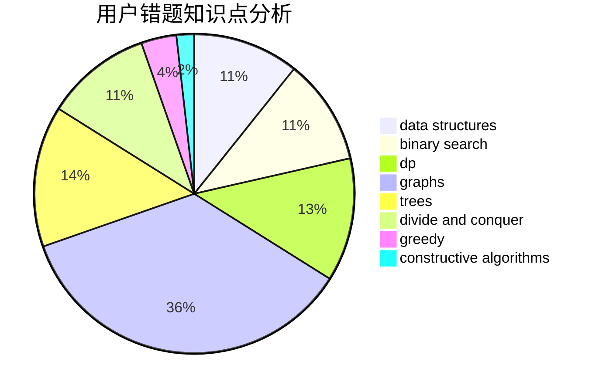

# leo21468

<!-- tabs:start -->

#### **用户提交结果分析**

#### **用户做题类型偏好分析**

#### **用户错题知识点分析**

<!-- tabs:end -->
# 推荐题目
[498D](https://codeforces.com/contest/498/problem/D)		data structures,
                        dp,
                        number theory		  
[911C](https://codeforces.com/contest/911/problem/C)		brute force,
                        constructive algorithms		  
[549E](https://codeforces.com/contest/549/problem/E)		geometry,
                        math		  
[18E](https://codeforces.com/contest/18/problem/E)		dp		  
[983E](https://codeforces.com/contest/983/problem/E)		binary search,
                        data structures,
                        trees		  
[725E](https://codeforces.com/contest/725/problem/E)		brute force,
                        greedy		  
[505A](https://codeforces.com/contest/505/problem/A)		brute force,
                        implementation,
                        strings		  
[1001I](https://codeforces.com/contest/1001/problem/I)		*special problem		  
[784A](https://codeforces.com/contest/784/problem/A)		*special problem		  
[604C](https://codeforces.com/contest/604/problem/C)		dsu,graphs,sortings,trees		  
