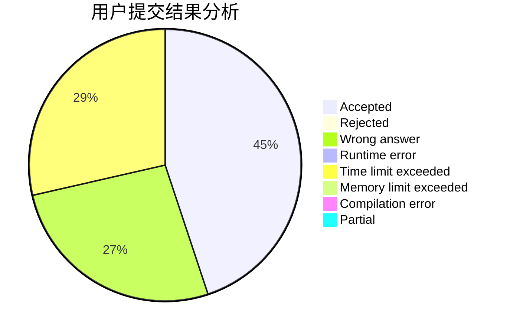
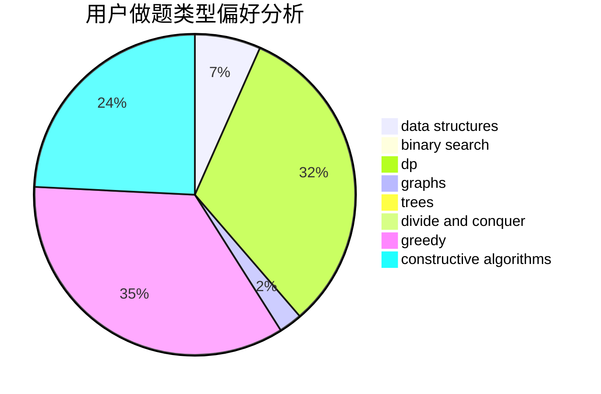
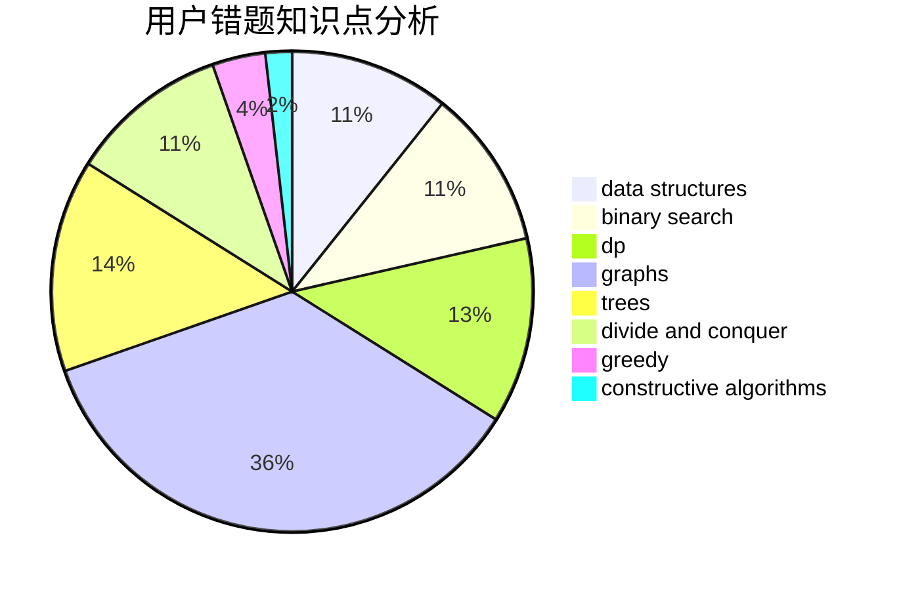

# leo21468

<!-- tabs:start -->

#### **用户提交结果分析**

#### **用户做题类型偏好分析**

#### **用户错题知识点分析**

<!-- tabs:end -->
# 推荐题目
[519D](https://codeforces.com/contest/519/problem/D)		data structures,
                        dp,
                        two pointers		  
[928B](https://codeforces.com/contest/928/problem/B)		*special problem,
                        dp		  
[574C](https://codeforces.com/contest/574/problem/C)		dsu,graphs,sortings,trees		  
[215C](https://codeforces.com/contest/215/problem/C)		brute force,
                        implementation		  
[999D](https://codeforces.com/contest/999/problem/D)		data structures,
                        greedy,
                        implementation		  
[743E](https://codeforces.com/contest/743/problem/E)		binary search,
                        bitmasks,
                        brute force,
                        dp		  
[525C](https://codeforces.com/contest/525/problem/C)		greedy,
                        math,
                        sortings		  
[1001I](https://codeforces.com/contest/1001/problem/I)		*special problem		  
[801A](https://codeforces.com/contest/801/problem/A)		brute force		  
[622F](https://codeforces.com/contest/622/problem/F)		math		  
