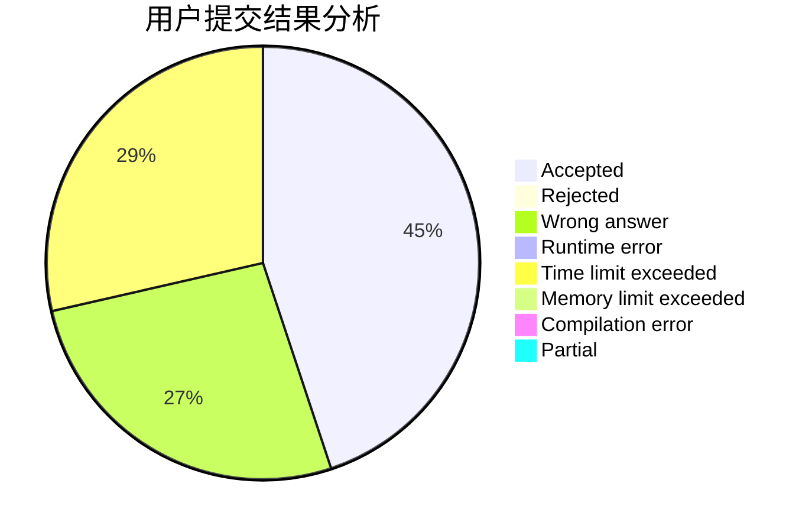
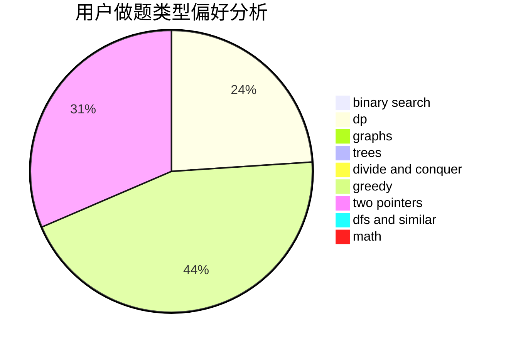

# leo21468

<!-- tabs:start -->

#### **用户提交结果分析**

#### **用户做题类型偏好分析**

<!-- tabs:end -->
# 推荐题目
[519D](https://codeforces.com/contest/519/problem/D)
[928B](https://codeforces.com/contest/928/problem/B)
[574C](https://codeforces.com/contest/574/problem/C)
[215C](https://codeforces.com/contest/215/problem/C)
[999D](https://codeforces.com/contest/999/problem/D)
[743E](https://codeforces.com/contest/743/problem/E)
[525C](https://codeforces.com/contest/525/problem/C)
[1001I](https://codeforces.com/contest/1001/problem/I)
[801A](https://codeforces.com/contest/801/problem/A)
[622F](https://codeforces.com/contest/622/problem/F)
