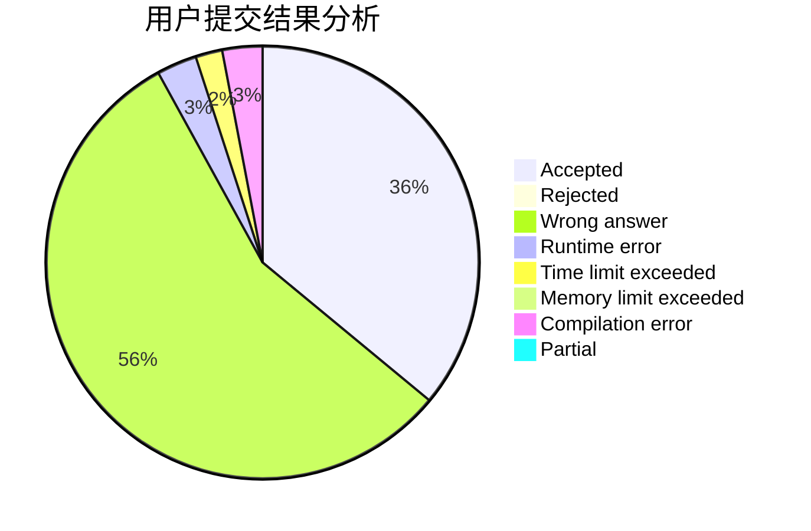
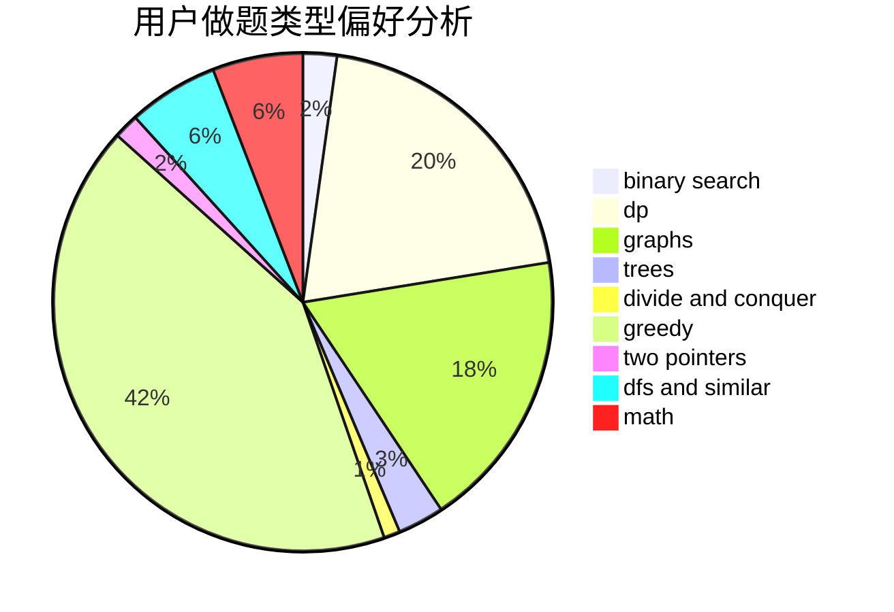

# lethalboy

<!-- tabs:start -->

#### **用户提交结果分析**

#### **用户做题类型偏好分析**

<!-- tabs:end -->
# 推荐题目
[808D](https://codeforces.com/contest/808/problem/D)
[1183C](https://codeforces.com/contest/1183/problem/C)
[1335B](https://codeforces.com/contest/1335/problem/B)
[474C](https://codeforces.com/contest/474/problem/C)
[509A](https://codeforces.com/contest/509/problem/A)
[1481D](https://codeforces.com/contest/1481/problem/D)
[1057B](https://codeforces.com/contest/1057/problem/B)
[1304D](https://codeforces.com/contest/1304/problem/D)
[216D](https://codeforces.com/contest/216/problem/D)
[599C](https://codeforces.com/contest/599/problem/C)
