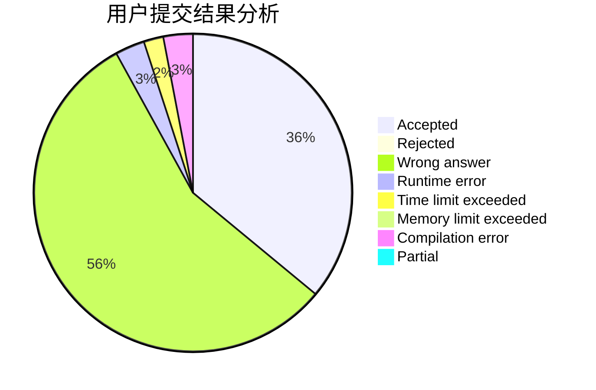
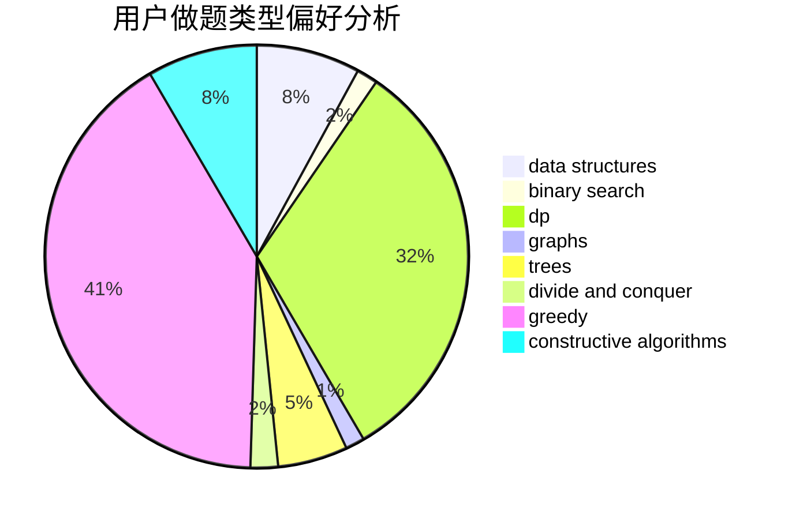
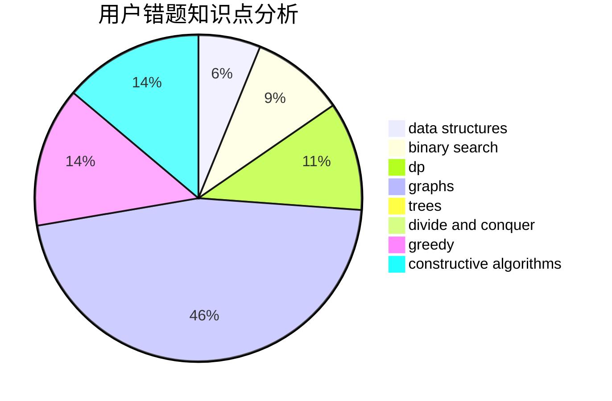

# lethalboy

<!-- tabs:start -->

#### **用户提交结果分析**

#### **用户做题类型偏好分析**

#### **用户错题知识点分析**

<!-- tabs:end -->
# 推荐题目
[808D](https://codeforces.com/contest/808/problem/D)		binary search,
                        data structures,
                        implementation		  
[1183C](https://codeforces.com/contest/1183/problem/C)		binary search,
                        math		  
[1335B](https://codeforces.com/contest/1335/problem/B)		constructive algorithms		  
[474C](https://codeforces.com/contest/474/problem/C)		brute force,
                        geometry		  
[509A](https://codeforces.com/contest/509/problem/A)		brute force,
                        implementation		  
[1481D](https://codeforces.com/contest/1481/problem/D)		brute force,
                        constructive algorithms,
                        graphs,
                        greedy,
                        implementation		  
[1057B](https://codeforces.com/contest/1057/problem/B)		*special problem,
                        brute force		  
[1304D](https://codeforces.com/contest/1304/problem/D)		constructive algorithms,
                        graphs,
                        greedy,
                        two pointers		  
[216D](https://codeforces.com/contest/216/problem/D)		binary search,
                        sortings,
                        two pointers		  
[599C](https://codeforces.com/contest/599/problem/C)		sortings		  
