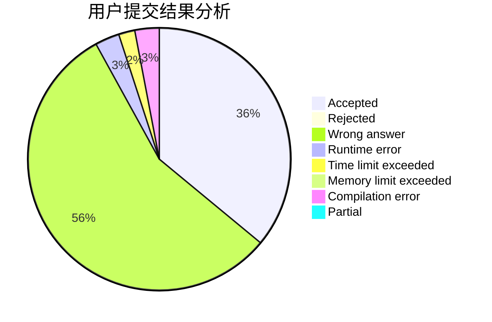
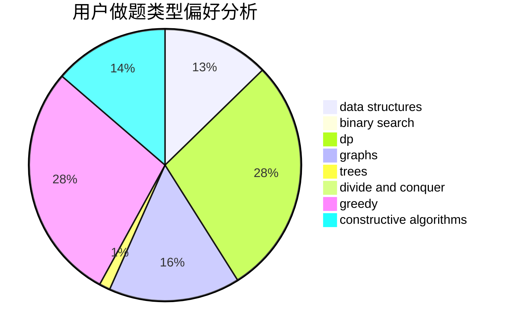
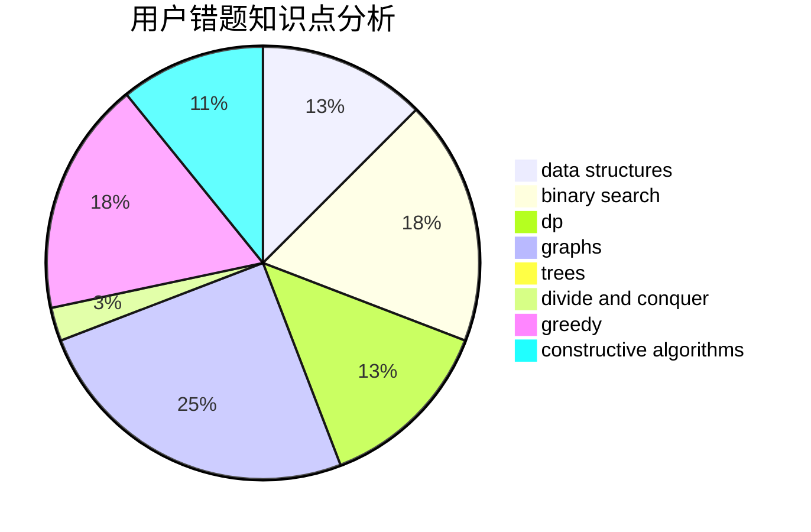

# lethalboy

<!-- tabs:start -->

#### **用户提交结果分析**

#### **用户做题类型偏好分析**

#### **用户错题知识点分析**

<!-- tabs:end -->
# 推荐题目
[792E](https://codeforces.com/contest/792/problem/E)		greedy,
                        math,
                        number theory		  
[1180B](https://codeforces.com/contest/1180/problem/B)		greedy,
                        implementation		  
[1329B](https://codeforces.com/contest/1329/problem/B)		bitmasks,
                        combinatorics,
                        math		  
[452C](https://codeforces.com/contest/452/problem/C)		combinatorics,
                        math,
                        probabilities		  
[489A](https://codeforces.com/contest/489/problem/A)		greedy,
                        implementation,
                        sortings		  
[1473A](https://codeforces.com/contest/1473/problem/A)		greedy,
                        implementation,
                        math,
                        sortings		  
[1056F](https://codeforces.com/contest/1056/problem/F)		binary search,
                        dp,
                        math		  
[1297D](https://codeforces.com/contest/1297/problem/D)		*special problem,
                        binary search,
                        greedy,
                        sortings		  
[193C](https://codeforces.com/contest/193/problem/C)		constructive algorithms,
                        greedy,
                        math,
                        matrices		  
[578A](https://codeforces.com/contest/578/problem/A)		geometry,
                        math		  
