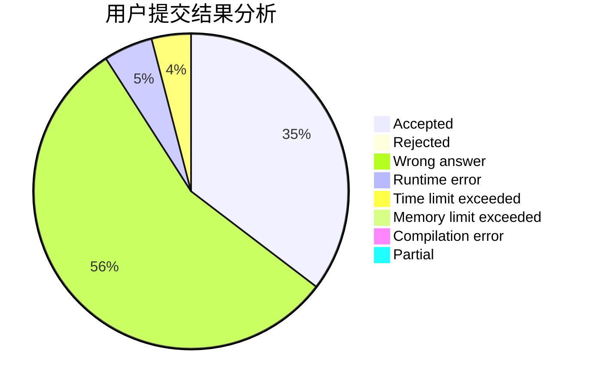
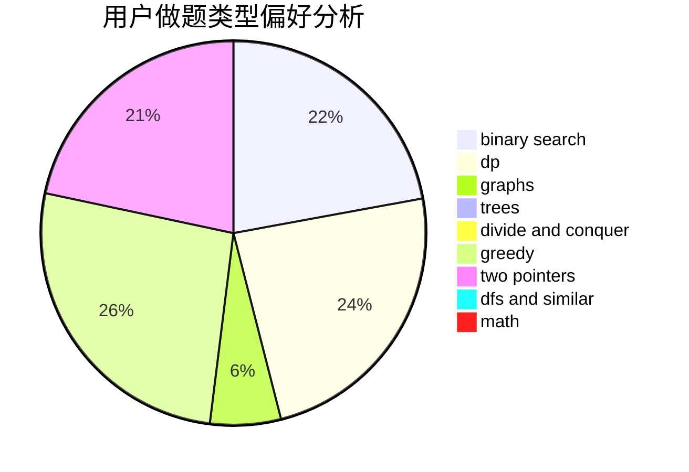

# lexiyvv

<!-- tabs:start -->

#### **用户提交结果分析**

#### **用户做题类型偏好分析**

<!-- tabs:end -->
# 推荐题目
[1255A](https://codeforces.com/contest/1255/problem/A)
[1203A](https://codeforces.com/contest/1203/problem/A)
[1031B](https://codeforces.com/contest/1031/problem/B)
[1041A](https://codeforces.com/contest/1041/problem/A)
[978F](https://codeforces.com/contest/978/problem/F)
[1064D](https://codeforces.com/contest/1064/problem/D)
[599E](https://codeforces.com/contest/599/problem/E)
[11841](https://codeforces.com/contest/1184/problem/1)
[995C](https://codeforces.com/contest/995/problem/C)
[965A](https://codeforces.com/contest/965/problem/A)
