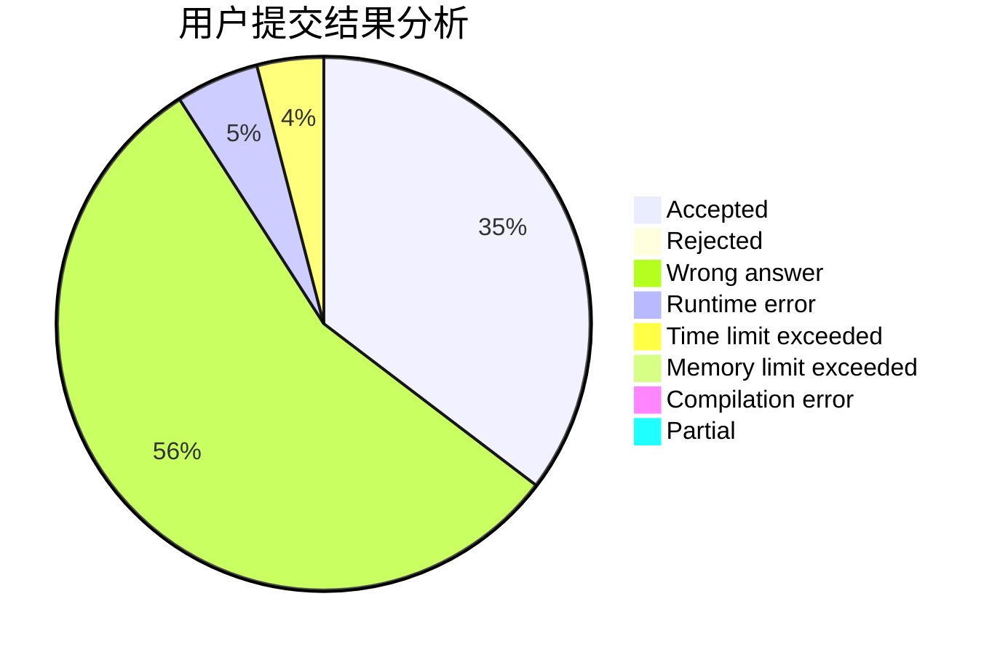
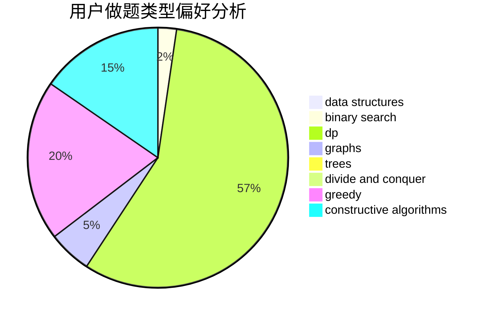
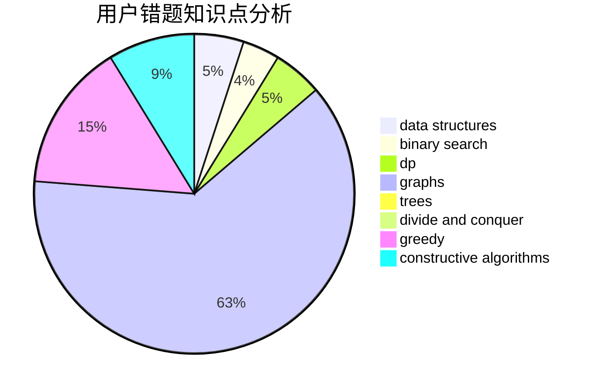

# lexiyvv

<!-- tabs:start -->

#### **用户提交结果分析**

#### **用户做题类型偏好分析**

#### **用户错题知识点分析**

<!-- tabs:end -->
# 推荐题目
[1250I](https://codeforces.com/contest/1250/problem/I)		binary search,
                        brute force,
                        greedy,
                        shortest paths		  
[1199E](https://codeforces.com/contest/1199/problem/E)		dsu,graphs,sortings,trees		  
[1030E](https://codeforces.com/contest/1030/problem/E)		bitmasks,
                        dp		  
[1040A](https://codeforces.com/contest/1040/problem/A)		greedy		  
[957C](https://codeforces.com/contest/957/problem/C)		dsu,graphs,sortings,trees		  
[1064A](https://codeforces.com/contest/1064/problem/A)		brute force,
                        geometry,
                        math		  
[578C](https://codeforces.com/contest/578/problem/C)		ternary search		  
[1181D](https://codeforces.com/contest/1181/problem/D)		binary search,
                        data structures,
                        implementation,
                        sortings,
                        trees,
                        two pointers		  
[980A](https://codeforces.com/contest/980/problem/A)		implementation,
                        math		  
[947E](https://codeforces.com/contest/947/problem/E)		dsu,graphs,sortings,trees		  
