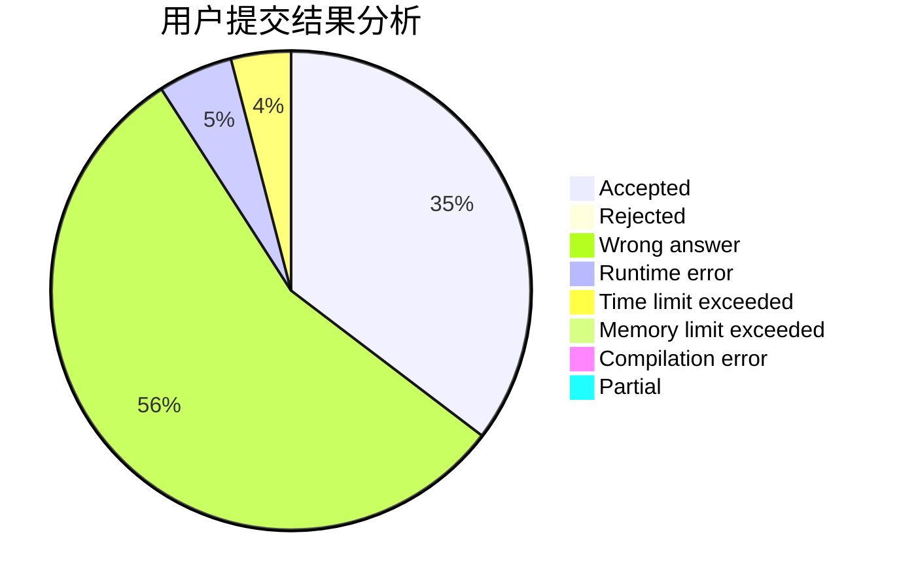
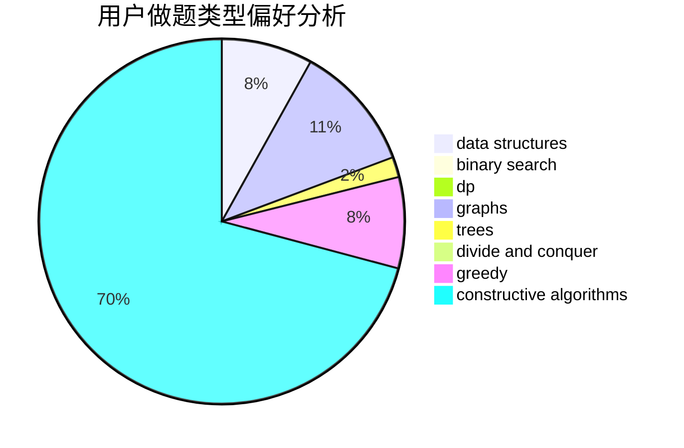
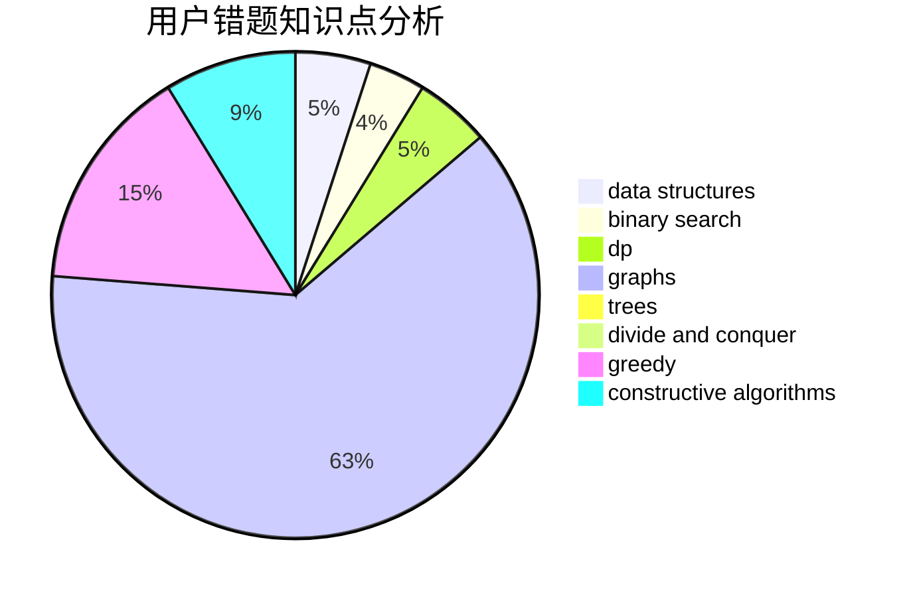

# lexiyvv

<!-- tabs:start -->

#### **用户提交结果分析**

#### **用户做题类型偏好分析**

#### **用户错题知识点分析**

<!-- tabs:end -->
# 推荐题目
[1255A](https://codeforces.com/contest/1255/problem/A)		math		  
[1203A](https://codeforces.com/contest/1203/problem/A)		implementation		  
[1031B](https://codeforces.com/contest/1031/problem/B)		nan		  
[1041A](https://codeforces.com/contest/1041/problem/A)		greedy,
                        implementation,
                        sortings		  
[978F](https://codeforces.com/contest/978/problem/F)		binary search,
                        data structures,
                        implementation		  
[1064D](https://codeforces.com/contest/1064/problem/D)		dsu,graphs,sortings,trees		  
[599E](https://codeforces.com/contest/599/problem/E)		bitmasks,
                        dp,
                        trees		  
[11841](https://codeforces.com/contest/1184/problem/1)		dsu,graphs,sortings,trees		  
[995C](https://codeforces.com/contest/995/problem/C)		brute force,
                        data structures,
                        geometry,
                        greedy,
                        math,
                        sortings		  
[965A](https://codeforces.com/contest/965/problem/A)		math		  
