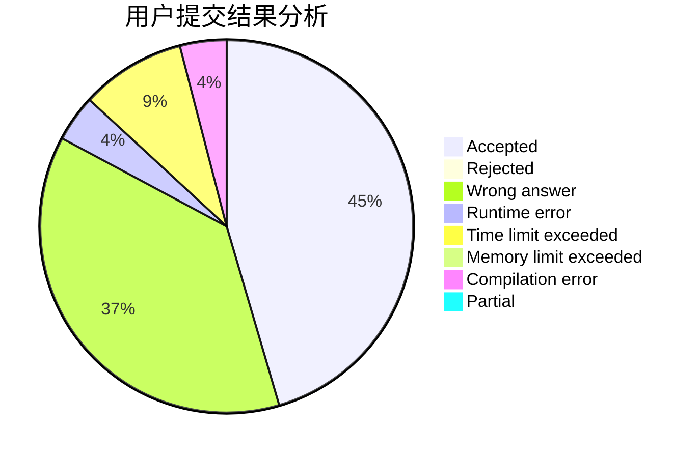
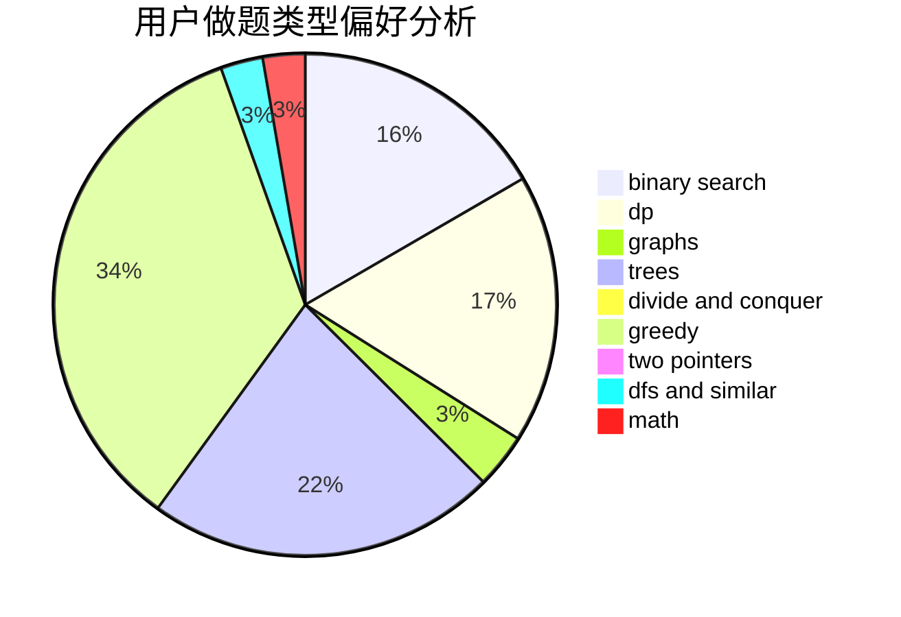

# lexsming

<!-- tabs:start -->

#### **用户提交结果分析**

#### **用户做题类型偏好分析**

<!-- tabs:end -->
# 推荐题目
[1367C](https://codeforces.com/contest/1367/problem/C)
[266E](https://codeforces.com/contest/266/problem/E)
[56B](https://codeforces.com/contest/56/problem/B)
[219A](https://codeforces.com/contest/219/problem/A)
[434A](https://codeforces.com/contest/434/problem/A)
[702B](https://codeforces.com/contest/702/problem/B)
[1381E](https://codeforces.com/contest/1381/problem/E)
[922C](https://codeforces.com/contest/922/problem/C)
[805D](https://codeforces.com/contest/805/problem/D)
[612C](https://codeforces.com/contest/612/problem/C)
