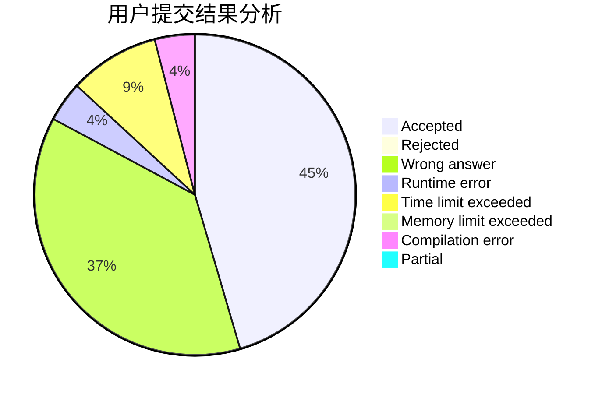
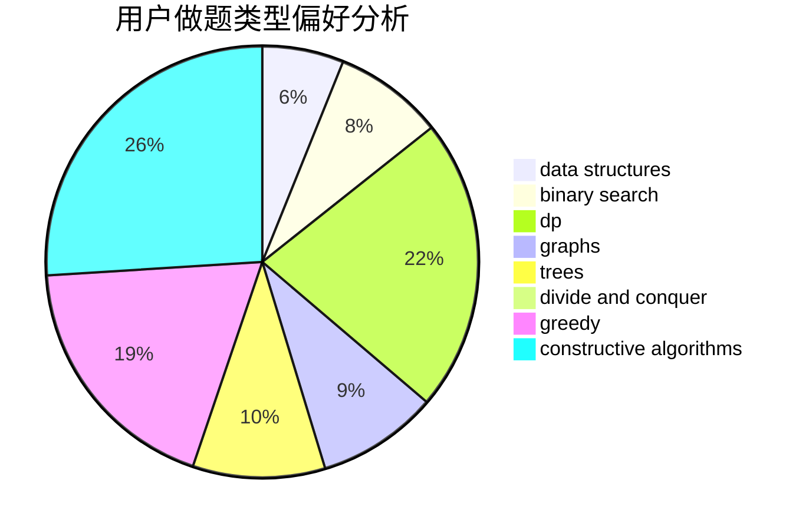
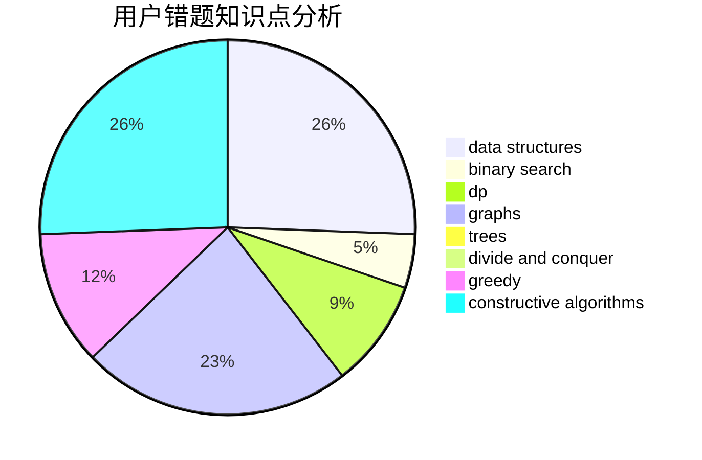

# lexsming

<!-- tabs:start -->

#### **用户提交结果分析**

#### **用户做题类型偏好分析**

#### **用户错题知识点分析**

<!-- tabs:end -->
# 推荐题目
[1359D](https://codeforces.com/contest/1359/problem/D)		data structures,
                        dp,
                        implementation,
                        two pointers		  
[246C](https://codeforces.com/contest/246/problem/C)		brute force,
                        constructive algorithms,
                        greedy		  
[545B](https://codeforces.com/contest/545/problem/B)		greedy		  
[197A](https://codeforces.com/contest/197/problem/A)		constructive algorithms,
                        games,
                        math		  
[405A](https://codeforces.com/contest/405/problem/A)		greedy,
                        implementation,
                        sortings		  
[678D](https://codeforces.com/contest/678/problem/D)		math,
                        number theory		  
[1373B](https://codeforces.com/contest/1373/problem/B)		games		  
[908B](https://codeforces.com/contest/908/problem/B)		brute force,
                        implementation		  
[791B](https://codeforces.com/contest/791/problem/B)		dsu,graphs,sortings,trees		  
[594A](https://codeforces.com/contest/594/problem/A)		games		  
