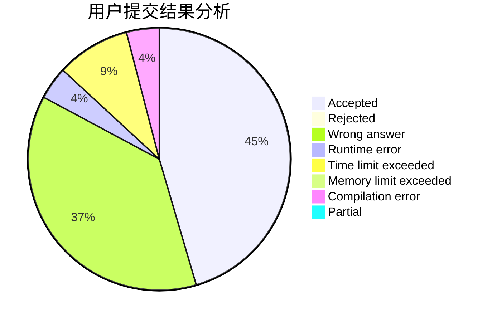
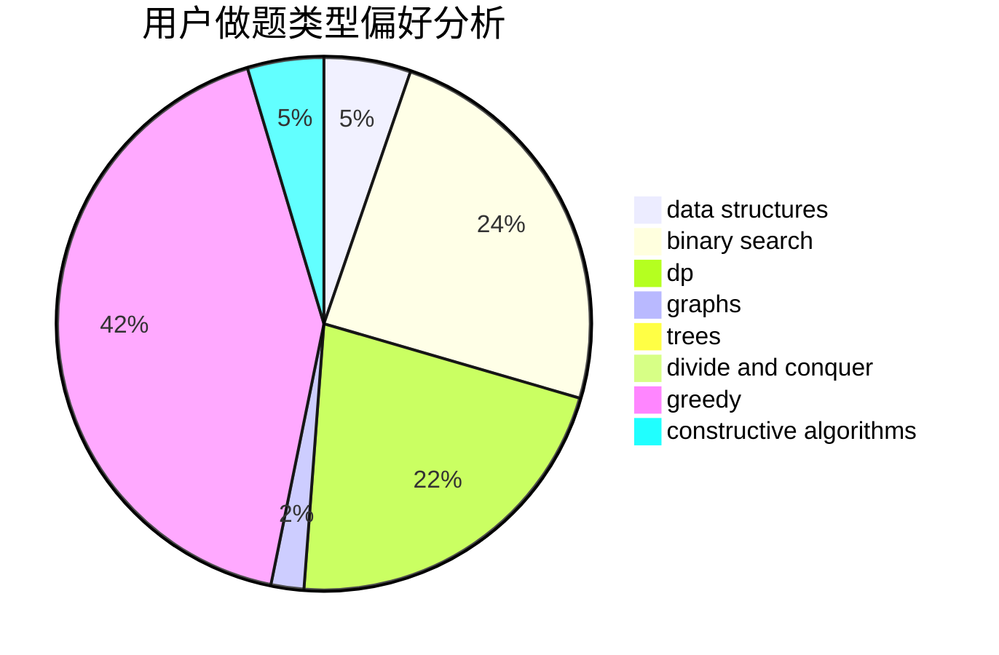
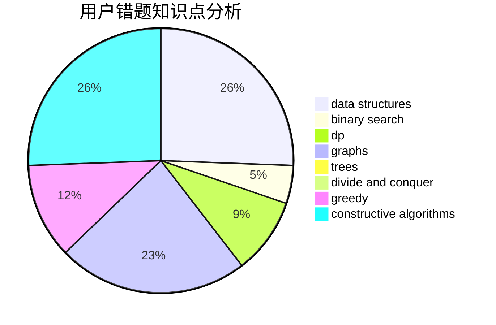

# lexsming

<!-- tabs:start -->

#### **用户提交结果分析**

#### **用户做题类型偏好分析**

#### **用户错题知识点分析**

<!-- tabs:end -->
# 推荐题目
[1367C](https://codeforces.com/contest/1367/problem/C)		constructive algorithms,
                        greedy,
                        math		  
[266E](https://codeforces.com/contest/266/problem/E)		data structures,
                        math		  
[56B](https://codeforces.com/contest/56/problem/B)		implementation		  
[219A](https://codeforces.com/contest/219/problem/A)		implementation,
                        strings		  
[434A](https://codeforces.com/contest/434/problem/A)		dsu,graphs,sortings,trees		  
[702B](https://codeforces.com/contest/702/problem/B)		brute force,
                        data structures,
                        implementation,
                        math		  
[1381E](https://codeforces.com/contest/1381/problem/E)		geometry,
                        math,
                        sortings		  
[922C](https://codeforces.com/contest/922/problem/C)		brute force,
                        number theory		  
[805D](https://codeforces.com/contest/805/problem/D)		dsu,graphs,sortings,trees		  
[612C](https://codeforces.com/contest/612/problem/C)		data structures,
                        expression parsing,
                        math		  
