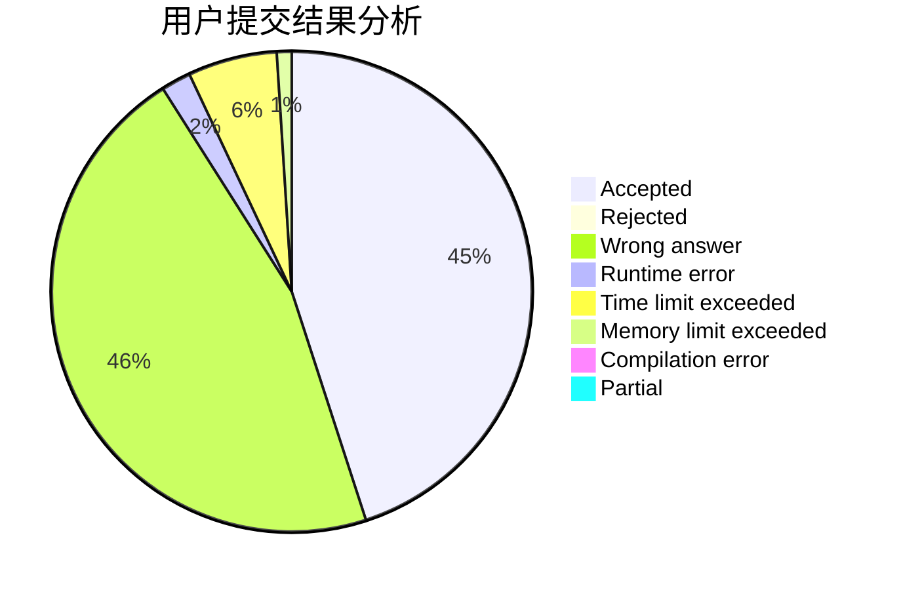
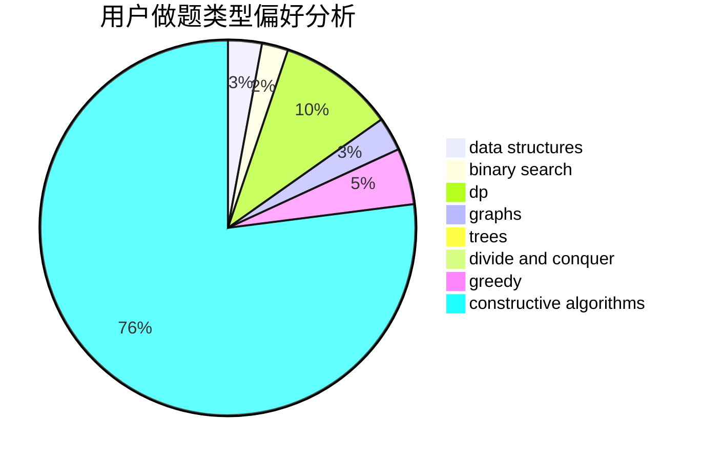
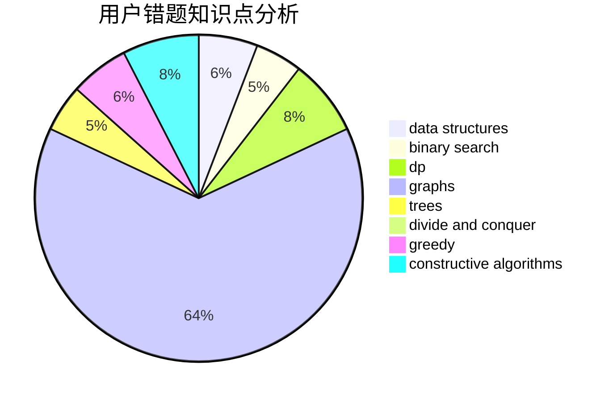

# lfw

<!-- tabs:start -->

#### **用户提交结果分析**

#### **用户做题类型偏好分析**

#### **用户错题知识点分析**

<!-- tabs:end -->
# 推荐题目
[860A](https://codeforces.com/contest/860/problem/A)		dsu,graphs,sortings,trees		  
[1299D](https://codeforces.com/contest/1299/problem/D)		bitmasks,
                        combinatorics,
                        dfs and similar,
                        dp,
                        graphs,
                        graphs,
                        math,
                        trees		  
[656E](https://codeforces.com/contest/656/problem/E)		*special problem		  
[381B](https://codeforces.com/contest/381/problem/B)		greedy,
                        implementation,
                        sortings		  
[791C](https://codeforces.com/contest/791/problem/C)		dsu,graphs,sortings,trees		  
[11291](https://codeforces.com/contest/1129/problem/1)		dsu,graphs,sortings,trees		  
[1054C](https://codeforces.com/contest/1054/problem/C)		constructive algorithms,
                        implementation		  
[1138E](https://codeforces.com/contest/1138/problem/E)		dsu,graphs,sortings,trees		  
[591D](https://codeforces.com/contest/591/problem/D)		dsu,graphs,sortings,trees		  
[924A](https://codeforces.com/contest/924/problem/A)		greedy,
                        implementation		  
