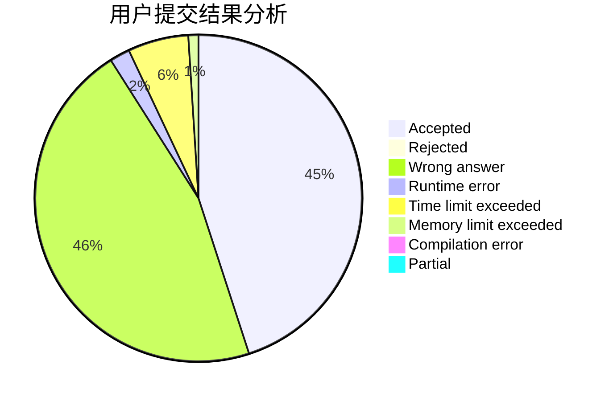
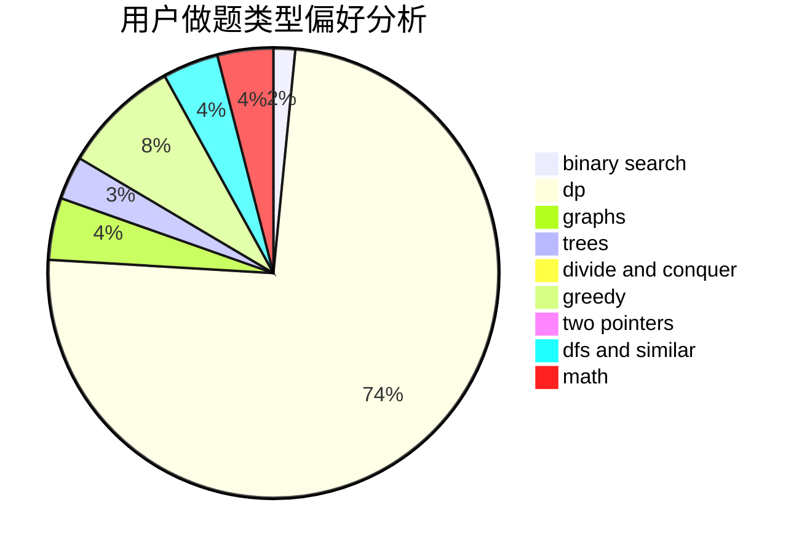

# lfw

<!-- tabs:start -->

#### **用户提交结果分析**

#### **用户做题类型偏好分析**

<!-- tabs:end -->
# 推荐题目
[860A](https://codeforces.com/contest/860/problem/A)
[1299D](https://codeforces.com/contest/1299/problem/D)
[656E](https://codeforces.com/contest/656/problem/E)
[381B](https://codeforces.com/contest/381/problem/B)
[791C](https://codeforces.com/contest/791/problem/C)
[11291](https://codeforces.com/contest/1129/problem/1)
[1054C](https://codeforces.com/contest/1054/problem/C)
[1138E](https://codeforces.com/contest/1138/problem/E)
[591D](https://codeforces.com/contest/591/problem/D)
[924A](https://codeforces.com/contest/924/problem/A)
