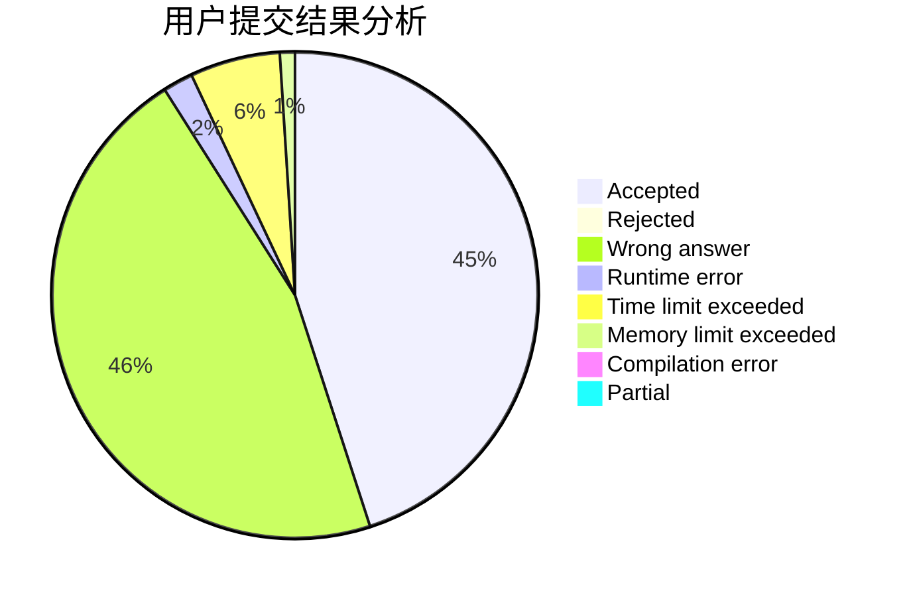
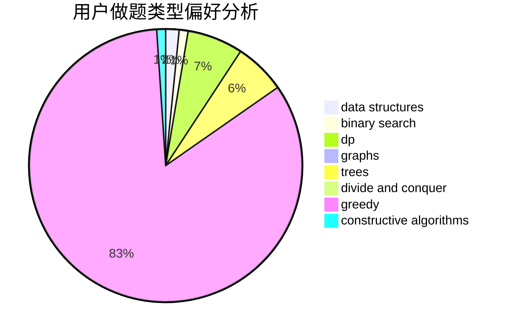
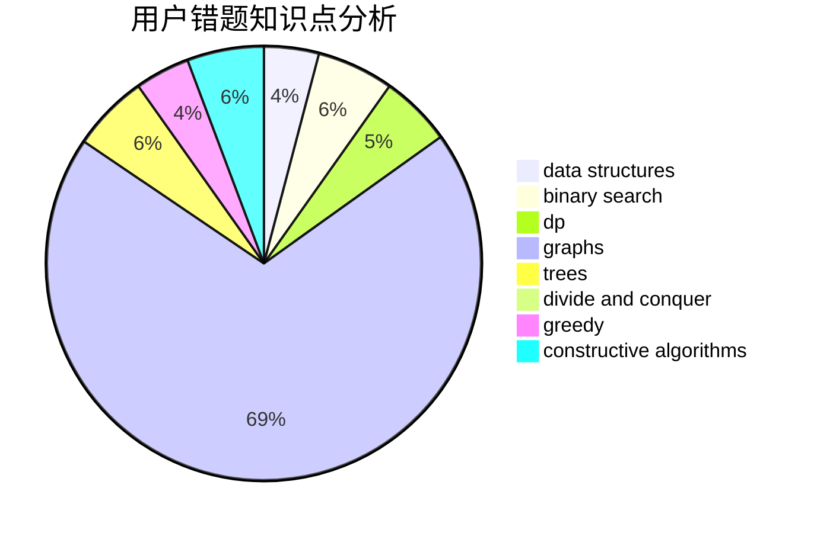

# lfw

<!-- tabs:start -->

#### **用户提交结果分析**

#### **用户做题类型偏好分析**

#### **用户错题知识点分析**

<!-- tabs:end -->
# 推荐题目
[841A](https://codeforces.com/contest/841/problem/A)		brute force,
                        implementation		  
[1292D](https://codeforces.com/contest/1292/problem/D)		dp,
                        graphs,
                        greedy,
                        math,
                        number theory,
                        trees		  
[628D](https://codeforces.com/contest/628/problem/D)		dp		  
[356C](https://codeforces.com/contest/356/problem/C)		combinatorics,
                        constructive algorithms,
                        greedy,
                        implementation		  
[771D](https://codeforces.com/contest/771/problem/D)		dp		  
[1119D](https://codeforces.com/contest/1119/problem/D)		binary search,
                        sortings		  
[1053E](https://codeforces.com/contest/1053/problem/E)		constructive algorithms,
                        trees		  
[1136C](https://codeforces.com/contest/1136/problem/C)		constructive algorithms,
                        sortings		  
[571C](https://codeforces.com/contest/571/problem/C)		constructive algorithms,
                        dfs and similar,
                        graphs,
                        greedy		  
[909C](https://codeforces.com/contest/909/problem/C)		dp		  
