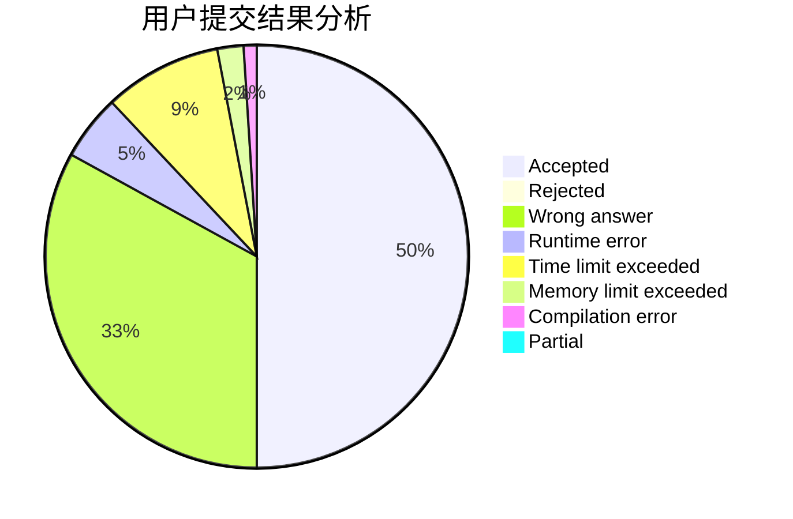
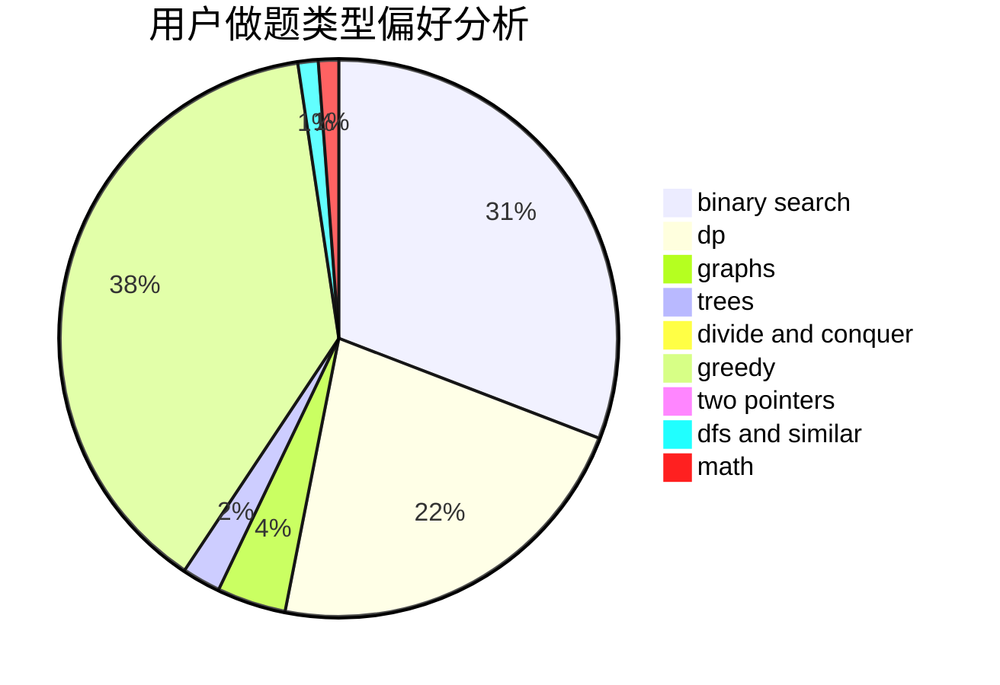

# lgswdn

<!-- tabs:start -->

#### **用户提交结果分析**

#### **用户做题类型偏好分析**

<!-- tabs:end -->
# 推荐题目
[1065G](https://codeforces.com/contest/1065/problem/G)
[453B](https://codeforces.com/contest/453/problem/B)
[13563](https://codeforces.com/contest/1356/problem/3)
[659G](https://codeforces.com/contest/659/problem/G)
[1088B](https://codeforces.com/contest/1088/problem/B)
[1093B](https://codeforces.com/contest/1093/problem/B)
[939F](https://codeforces.com/contest/939/problem/F)
[660B](https://codeforces.com/contest/660/problem/B)
[601A](https://codeforces.com/contest/601/problem/A)
[689A](https://codeforces.com/contest/689/problem/A)
