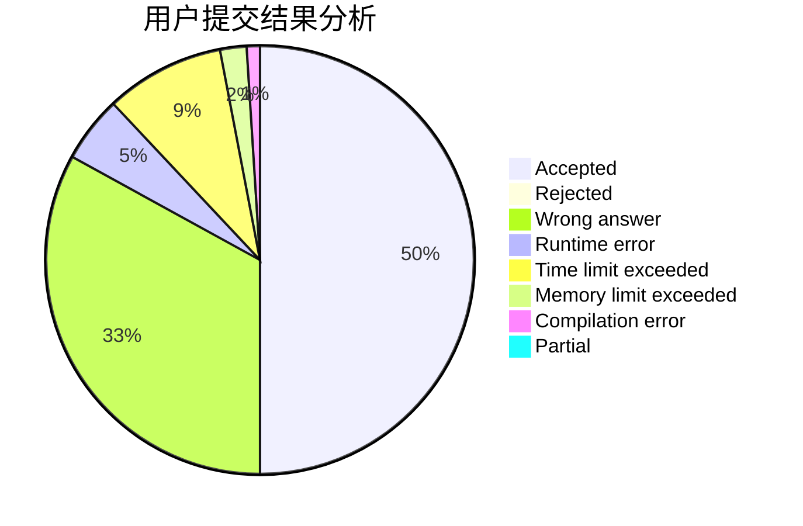
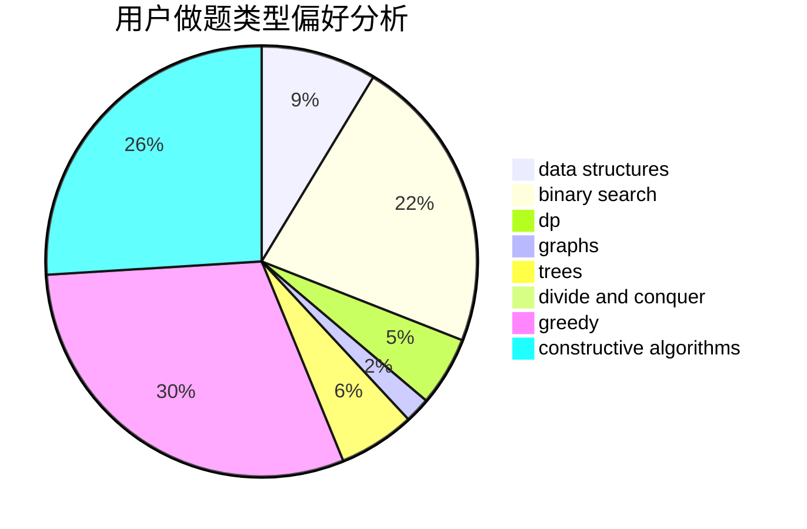
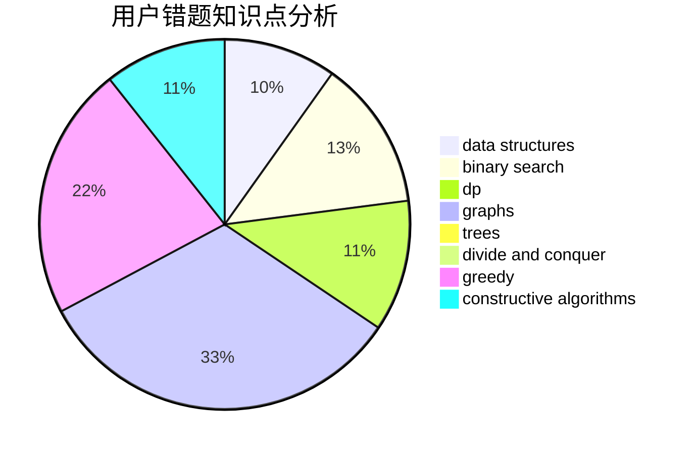

# lgswdn

<!-- tabs:start -->

#### **用户提交结果分析**

#### **用户做题类型偏好分析**

#### **用户错题知识点分析**

<!-- tabs:end -->
# 推荐题目
[1065C](https://codeforces.com/contest/1065/problem/C)		greedy		  
[431D](https://codeforces.com/contest/431/problem/D)		binary search,
                        bitmasks,
                        combinatorics,
                        dp,
                        math		  
[1349E](https://codeforces.com/contest/1349/problem/E)		constructive algorithms,
                        dp,
                        greedy		  
[62E](https://codeforces.com/contest/62/problem/E)		dp,
                        flows		  
[1087E](https://codeforces.com/contest/1087/problem/E)		dsu,graphs,sortings,trees		  
[1092E](https://codeforces.com/contest/1092/problem/E)		constructive algorithms,
                        dfs and similar,
                        greedy,
                        trees		  
[919E](https://codeforces.com/contest/919/problem/E)		chinese remainder theorem,
                        math,
                        number theory		  
[630F](https://codeforces.com/contest/630/problem/F)		combinatorics,
                        math		  
[580E](https://codeforces.com/contest/580/problem/E)		data structures,
                        hashing,
                        strings		  
[667A](https://codeforces.com/contest/667/problem/A)		geometry,
                        math		  
