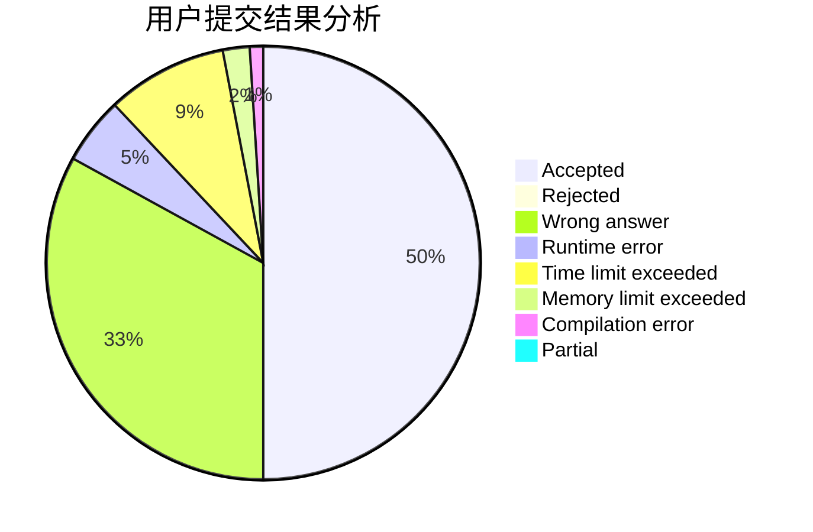
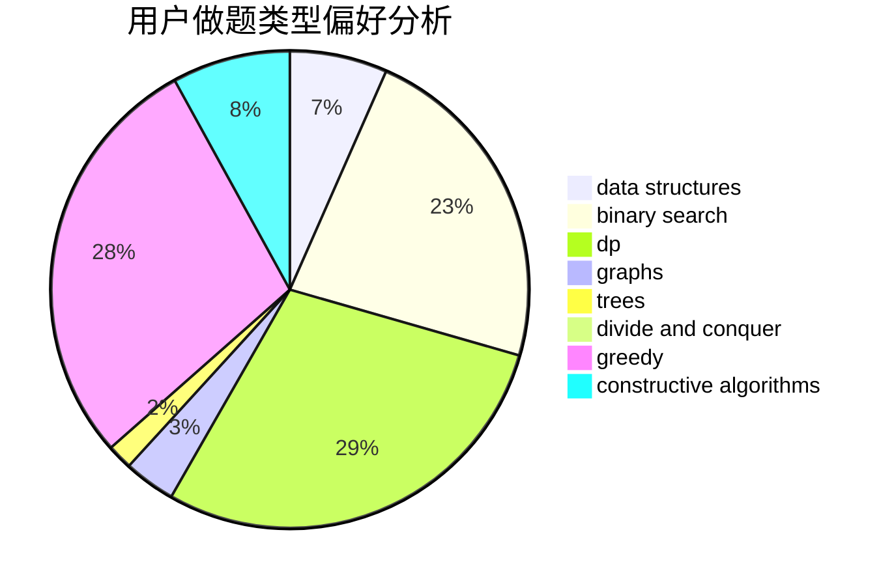
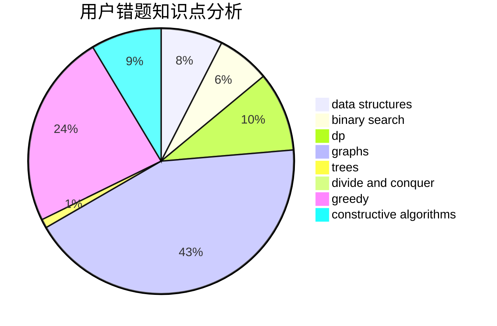

# lgswdn

<!-- tabs:start -->

#### **用户提交结果分析**

#### **用户做题类型偏好分析**

#### **用户错题知识点分析**

<!-- tabs:end -->
# 推荐题目
[1065G](https://codeforces.com/contest/1065/problem/G)		strings		  
[453B](https://codeforces.com/contest/453/problem/B)		bitmasks,
                        brute force,
                        dp		  
[13563](https://codeforces.com/contest/1356/problem/3)		dsu,graphs,sortings,trees		  
[659G](https://codeforces.com/contest/659/problem/G)		combinatorics,
                        dp,
                        number theory		  
[1088B](https://codeforces.com/contest/1088/problem/B)		implementation,
                        sortings		  
[1093B](https://codeforces.com/contest/1093/problem/B)		constructive algorithms,
                        greedy,
                        sortings,
                        strings		  
[939F](https://codeforces.com/contest/939/problem/F)		data structures,
                        dp		  
[660B](https://codeforces.com/contest/660/problem/B)		implementation		  
[601A](https://codeforces.com/contest/601/problem/A)		graphs,
                        shortest paths		  
[689A](https://codeforces.com/contest/689/problem/A)		brute force,
                        constructive algorithms,
                        implementation		  
