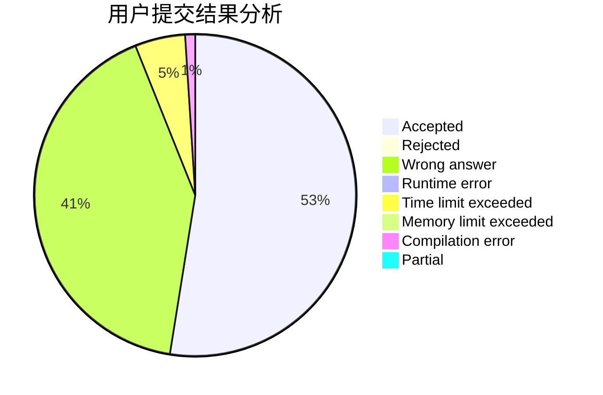
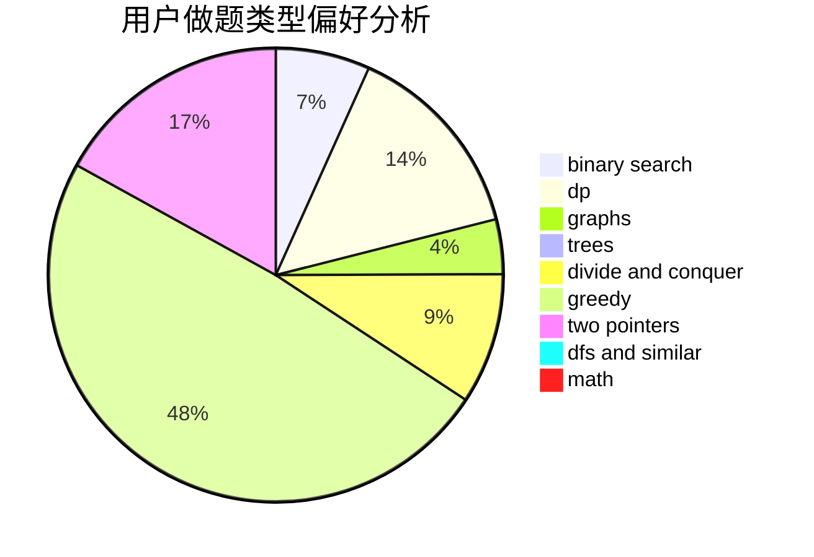

# lgwza

<!-- tabs:start -->

#### **用户提交结果分析**

#### **用户做题类型偏好分析**

<!-- tabs:end -->
# 推荐题目
[208A](https://codeforces.com/contest/208/problem/A)
[1090M](https://codeforces.com/contest/1090/problem/M)
[335F](https://codeforces.com/contest/335/problem/F)
[628C](https://codeforces.com/contest/628/problem/C)
[996B](https://codeforces.com/contest/996/problem/B)
[232E](https://codeforces.com/contest/232/problem/E)
[920C](https://codeforces.com/contest/920/problem/C)
[14C](https://codeforces.com/contest/14/problem/C)
[490B](https://codeforces.com/contest/490/problem/B)
[24B](https://codeforces.com/contest/24/problem/B)
