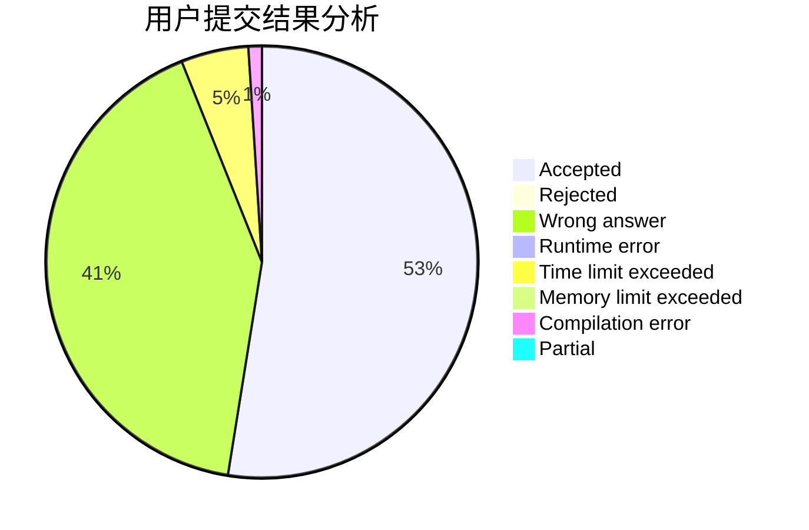
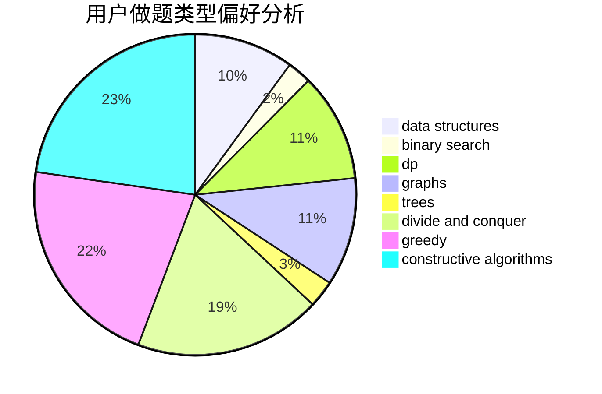
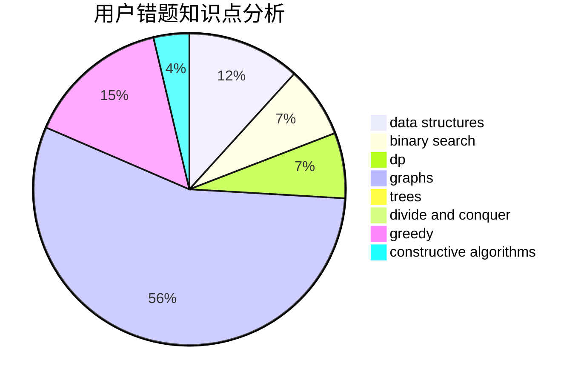

# lgwza

<!-- tabs:start -->

#### **用户提交结果分析**

#### **用户做题类型偏好分析**

#### **用户错题知识点分析**

<!-- tabs:end -->
# 推荐题目
[208A](https://codeforces.com/contest/208/problem/A)		strings		  
[1090M](https://codeforces.com/contest/1090/problem/M)		implementation		  
[335F](https://codeforces.com/contest/335/problem/F)		dp,
                        greedy		  
[628C](https://codeforces.com/contest/628/problem/C)		greedy,
                        strings		  
[996B](https://codeforces.com/contest/996/problem/B)		binary search,
                        math		  
[232E](https://codeforces.com/contest/232/problem/E)		bitmasks,
                        divide and conquer,
                        dp		  
[920C](https://codeforces.com/contest/920/problem/C)		dfs and similar,
                        greedy,
                        math,
                        sortings,
                        two pointers		  
[14C](https://codeforces.com/contest/14/problem/C)		brute force,
                        constructive algorithms,
                        geometry,
                        implementation,
                        math		  
[490B](https://codeforces.com/contest/490/problem/B)		dsu,
                        implementation		  
[24B](https://codeforces.com/contest/24/problem/B)		implementation		  
