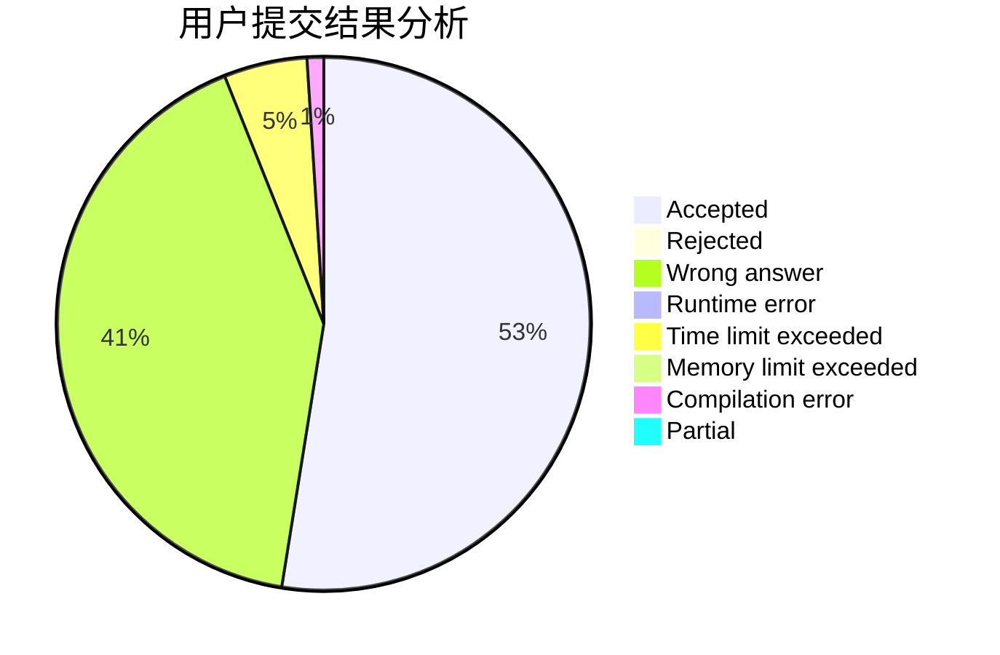
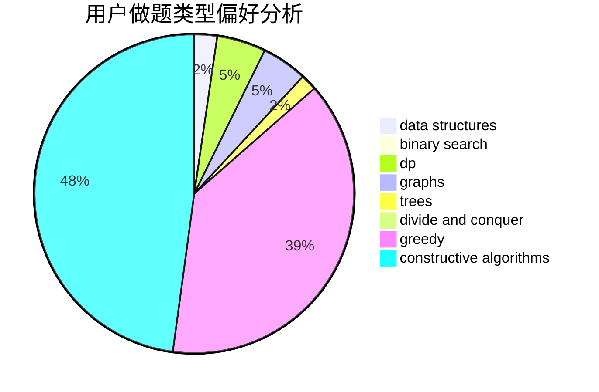
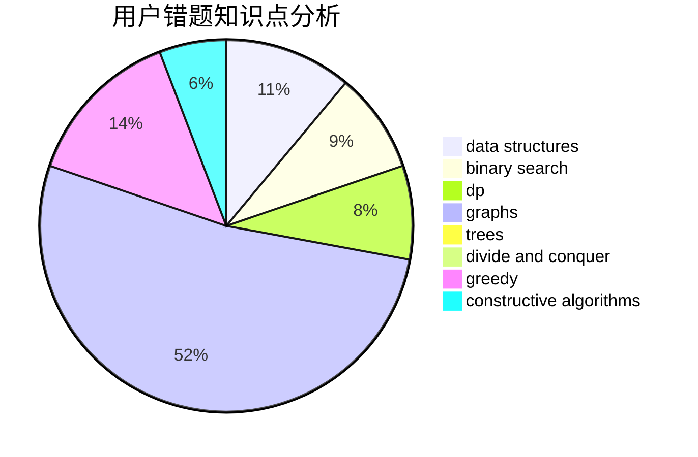

# lgwza

<!-- tabs:start -->

#### **用户提交结果分析**

#### **用户做题类型偏好分析**

#### **用户错题知识点分析**

<!-- tabs:end -->
# 推荐题目
[180D](https://codeforces.com/contest/180/problem/D)		greedy,
                        strings		  
[1090B](https://codeforces.com/contest/1090/problem/B)		nan		  
[312A](https://codeforces.com/contest/312/problem/A)		implementation,
                        strings		  
[609C](https://codeforces.com/contest/609/problem/C)		implementation,
                        math		  
[981A](https://codeforces.com/contest/981/problem/A)		brute force,
                        implementation,
                        strings		  
[213C](https://codeforces.com/contest/213/problem/C)		dp		  
[906E](https://codeforces.com/contest/906/problem/E)		dp,
                        string suffix structures,
                        strings		  
[1491F](https://codeforces.com/contest/1491/problem/F)		binary search,
                        constructive algorithms,
                        interactive		  
[472A](https://codeforces.com/contest/472/problem/A)		math,
                        number theory		  
[229E](https://codeforces.com/contest/229/problem/E)		combinatorics,
                        dp,
                        math,
                        probabilities		  
