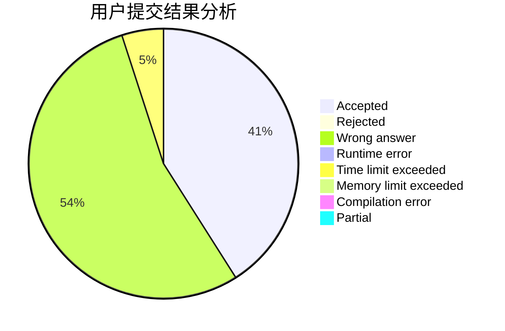
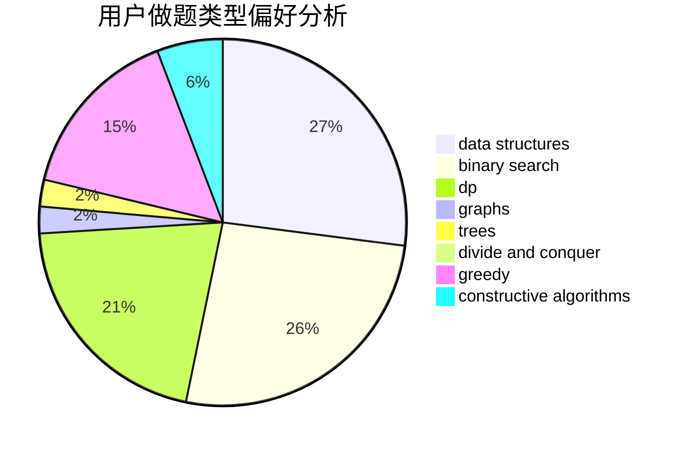

# lhy0930

<!-- tabs:start -->

#### **用户提交结果分析**

#### **用户做题类型偏好分析**

#### **用户错题知识点分析**

<!-- tabs:end -->
# 推荐题目
[516C](https://codeforces.com/contest/516/problem/C)		dsu,graphs,sortings,trees		  
[383A](https://codeforces.com/contest/383/problem/A)		data structures,
                        greedy		  
[1045I](https://codeforces.com/contest/1045/problem/I)		hashing,
                        strings		  
[1113F](https://codeforces.com/contest/1113/problem/F)		dsu,graphs,sortings,trees		  
[1070J](https://codeforces.com/contest/1070/problem/J)		dp		  
[1237G](https://codeforces.com/contest/1237/problem/G)		data structures,
                        dp,
                        greedy		  
[311E](https://codeforces.com/contest/311/problem/E)		flows		  
[1290D](https://codeforces.com/contest/1290/problem/D)		constructive algorithms,
                        graphs,
                        interactive		  
[626D](https://codeforces.com/contest/626/problem/D)		brute force,
                        combinatorics,
                        dp,
                        probabilities		  
[1287C](https://codeforces.com/contest/1287/problem/C)		dsu,graphs,sortings,trees		  
