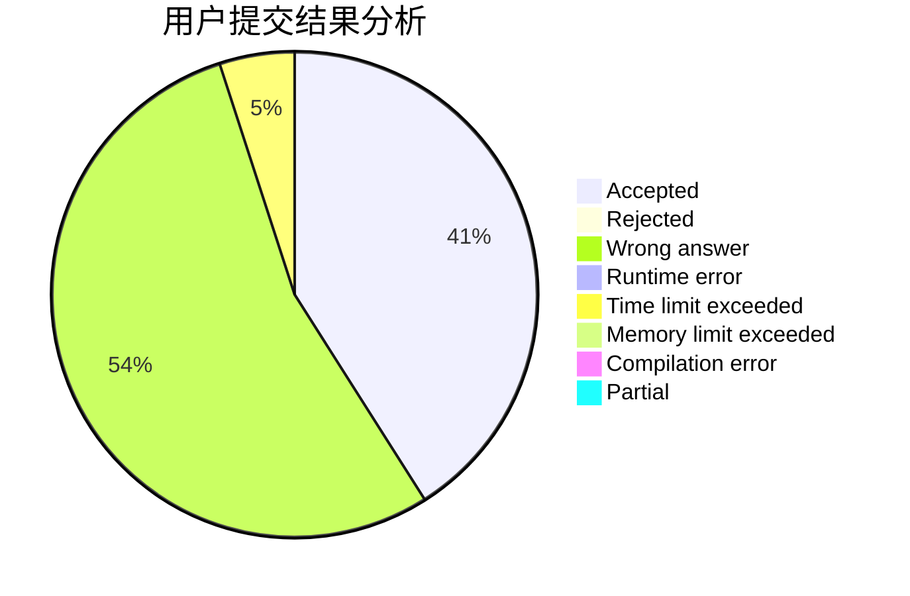
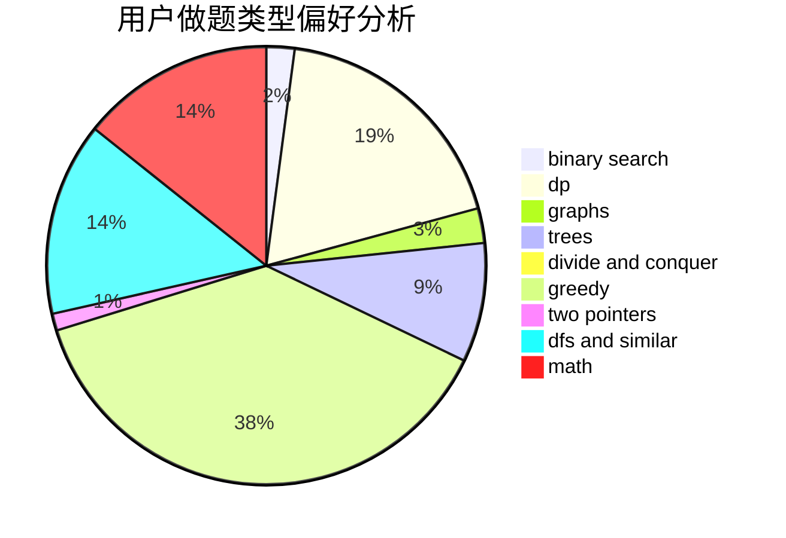

# lhy0930

<!-- tabs:start -->

#### **用户提交结果分析**

#### **用户做题类型偏好分析**

<!-- tabs:end -->
# 推荐题目
[543C](https://codeforces.com/contest/543/problem/C)
[414B](https://codeforces.com/contest/414/problem/B)
[1046H](https://codeforces.com/contest/1046/problem/H)
[1114C](https://codeforces.com/contest/1114/problem/C)
[1070M](https://codeforces.com/contest/1070/problem/M)
[1242E](https://codeforces.com/contest/1242/problem/E)
[335D](https://codeforces.com/contest/335/problem/D)
[1297A](https://codeforces.com/contest/1297/problem/A)
[652E](https://codeforces.com/contest/652/problem/E)
[1294F](https://codeforces.com/contest/1294/problem/F)
