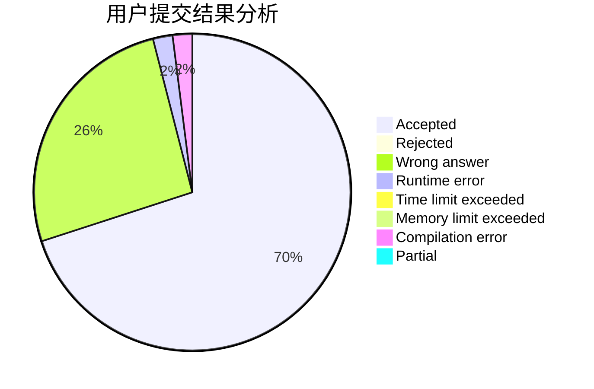
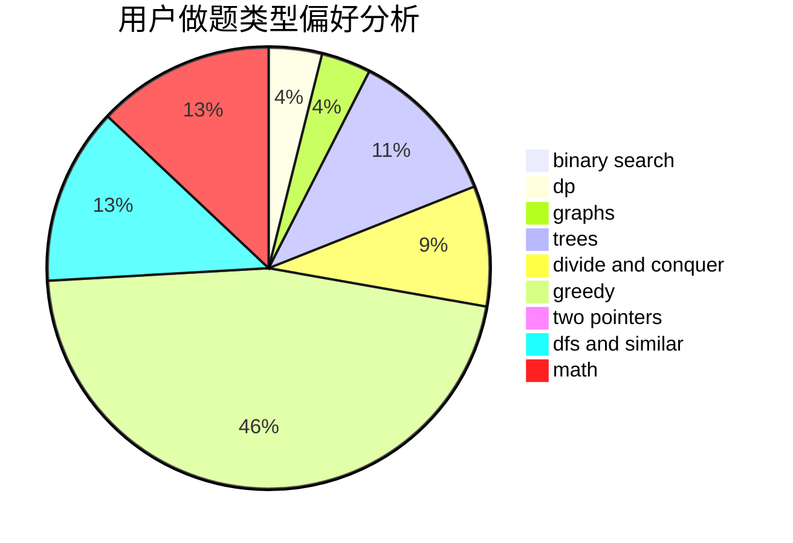

# lhyjdmc

<!-- tabs:start -->

#### **用户提交结果分析**

#### **用户做题类型偏好分析**

<!-- tabs:end -->
# 推荐题目
[557B](https://codeforces.com/contest/557/problem/B)
[870A](https://codeforces.com/contest/870/problem/A)
[1250N](https://codeforces.com/contest/1250/problem/N)
[147B](https://codeforces.com/contest/147/problem/B)
[778D](https://codeforces.com/contest/778/problem/D)
[708B](https://codeforces.com/contest/708/problem/B)
[860D](https://codeforces.com/contest/860/problem/D)
[260A](https://codeforces.com/contest/260/problem/A)
[1068F](https://codeforces.com/contest/1068/problem/F)
[1251C](https://codeforces.com/contest/1251/problem/C)
