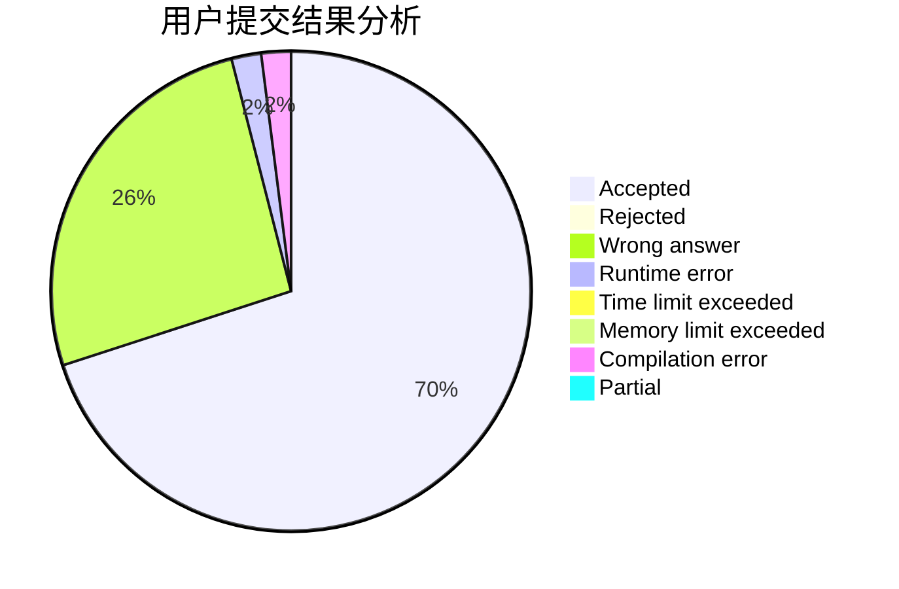
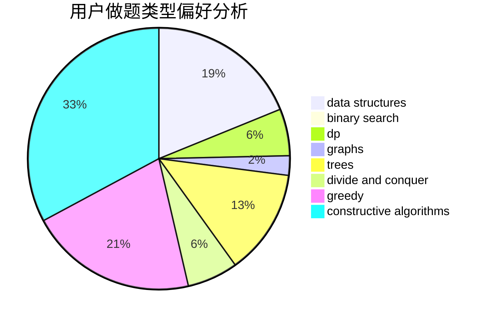

# lhyjdmc

<!-- tabs:start -->

#### **用户提交结果分析**

#### **用户做题类型偏好分析**

#### **用户错题知识点分析**

<!-- tabs:end -->
# 推荐题目
[557B](https://codeforces.com/contest/557/problem/B)		constructive algorithms,
                        implementation,
                        math,
                        sortings		  
[870A](https://codeforces.com/contest/870/problem/A)		brute force,
                        implementation		  
[1250N](https://codeforces.com/contest/1250/problem/N)		dfs and similar,
                        graphs,
                        greedy		  
[147B](https://codeforces.com/contest/147/problem/B)		binary search,
                        graphs,
                        matrices		  
[778D](https://codeforces.com/contest/778/problem/D)		constructive algorithms		  
[708B](https://codeforces.com/contest/708/problem/B)		constructive algorithms,
                        greedy,
                        implementation,
                        math		  
[860D](https://codeforces.com/contest/860/problem/D)		dsu,graphs,sortings,trees		  
[260A](https://codeforces.com/contest/260/problem/A)		implementation,
                        math		  
[1068F](https://codeforces.com/contest/1068/problem/F)		dsu,graphs,sortings,trees		  
[1251C](https://codeforces.com/contest/1251/problem/C)		greedy,
                        two pointers		  
