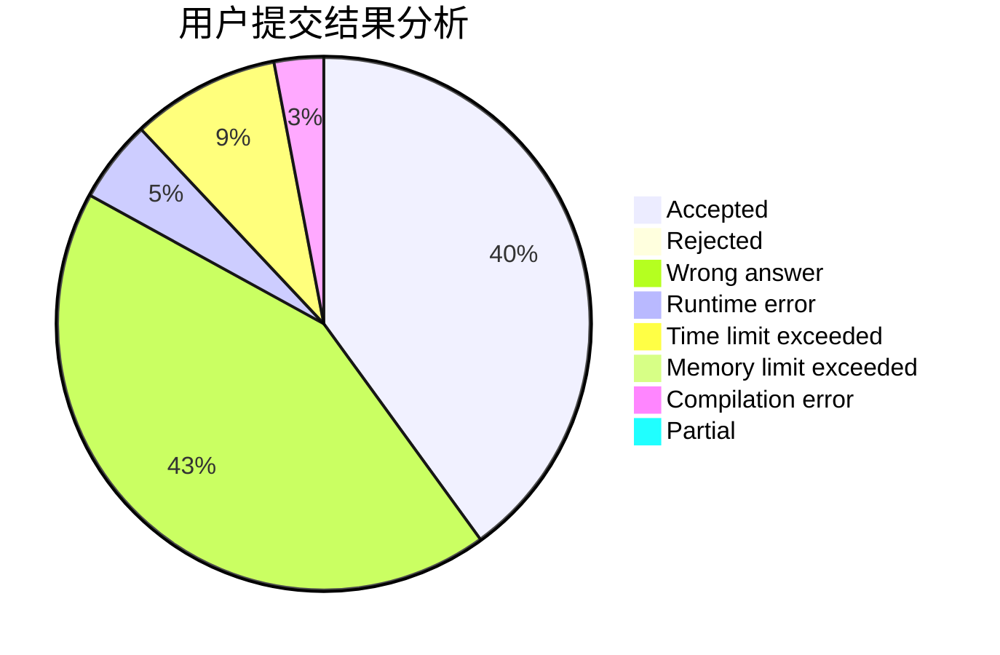
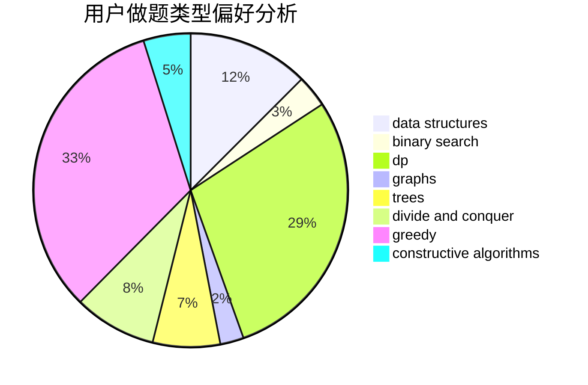
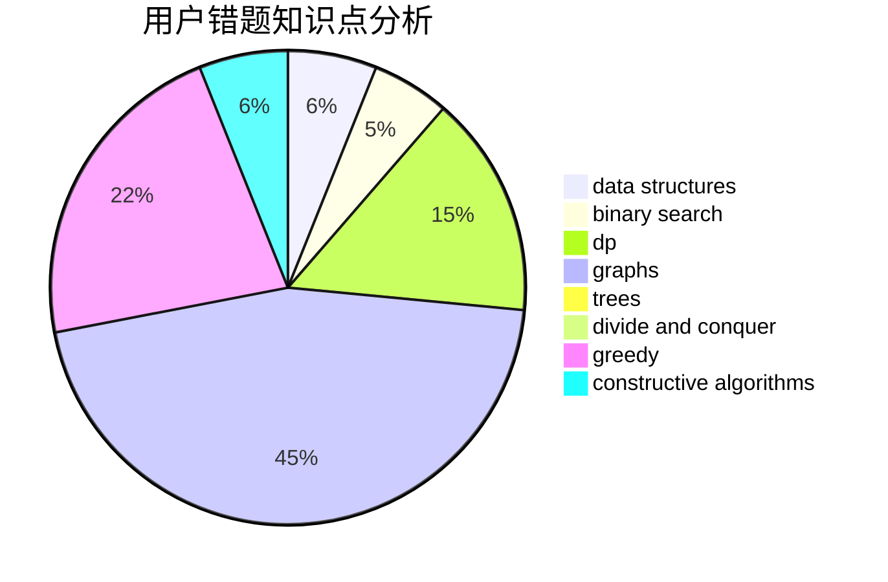

# BigWhiteRabbit

<!-- tabs:start -->

#### **用户提交结果分析**

#### **用户做题类型偏好分析**

#### **用户错题知识点分析**

<!-- tabs:end -->
# 推荐题目
[1475G](https://codeforces.com/contest/1475/problem/G)		dp,
                        math,
                        number theory,
                        sortings		  
[1148C](https://codeforces.com/contest/1148/problem/C)		constructive algorithms,
                        sortings		  
[1332A](https://codeforces.com/contest/1332/problem/A)		greedy,
                        implementation,
                        math		  
[1058E](https://codeforces.com/contest/1058/problem/E)		dsu,graphs,sortings,trees		  
[1161C](https://codeforces.com/contest/1161/problem/C)		dsu,graphs,sortings,trees		  
[1140A](https://codeforces.com/contest/1140/problem/A)		implementation		  
[553A](https://codeforces.com/contest/553/problem/A)		combinatorics,
                        dp,
                        math		  
[553C](https://codeforces.com/contest/553/problem/C)		dfs and similar,
                        dsu,
                        graphs		  
[552A](https://codeforces.com/contest/552/problem/A)		implementation,
                        math		  
[1345F](https://codeforces.com/contest/1345/problem/F)		dsu,graphs,sortings,trees		  
