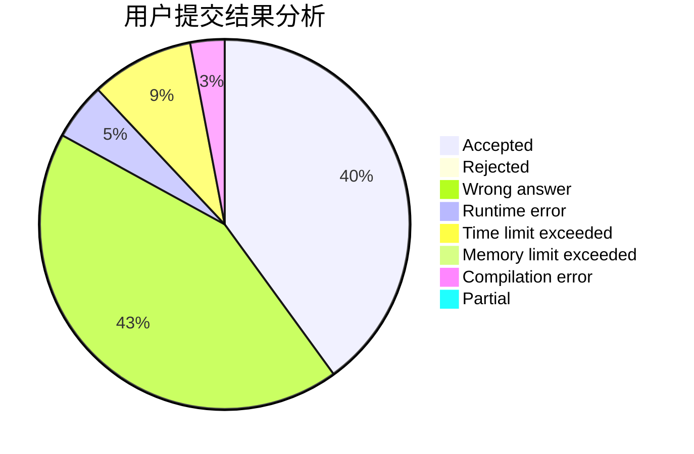
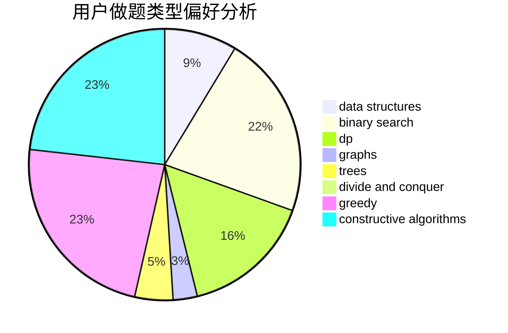
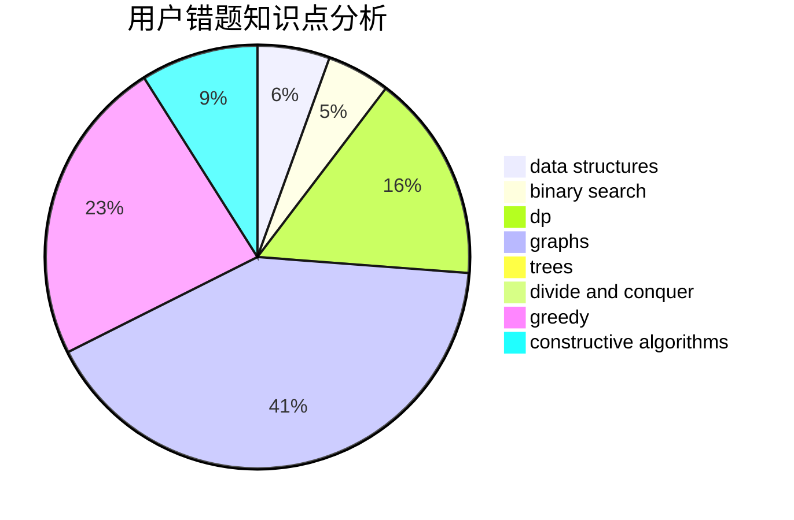

# BigWhiteRabbit
<!-- tabs:start -->
#### **用户提交结果分析**

#### **用户做题类型偏好分析**

#### **用户错题知识点分析**

<!-- tabs:end -->
# 推荐题目
[Linova and Kingdom](https://codeforces.com/contest/1337/problem/C)		dfs and similar,
                        dp,
                        greedy,
                        sortings,
                        trees		  
[Fuzzy Search](http://codeforces.com/problemset/problem/528/D)		bitmasks,
                        brute force,
                        fft		  
[Right Triangles](http://codeforces.com/problemset/problem/52/B)		combinatorics		  
[Beautiful Bracket Sequence (hard version)](http://codeforces.com/problemset/problem/1264/D2)		combinatorics,
                        probabilities		  
[Camels](http://codeforces.com/problemset/problem/14/E)		dp		  
[Skyscrapers](https://codeforces.com/contest/1138/problem/C)		implementation,
                        sortings		  
[Multiple Testcases](http://codeforces.com/problemset/problem/1342/D)		binary search,
                        constructive algorithms,
                        data structures,
                        greedy,
                        sortings,
                        two pointers		  
[Data Center Drama](http://codeforces.com/problemset/problem/527/E)		dfs and similar,
                        graphs		  
[Clique Problem](https://codeforces.com/contest/528/problem/B)		data structures,
                        dp,
                        greedy,
                        implementation,
                        sortings		  
[123-sequence](http://codeforces.com/problemset/problem/52/A)		implementation		  
<!-- tabs:start -->
#### **data structures**
[Linova and Kingdom](http://codeforces.com/problemset/problem/1342/D)		binary search,
                        constructive algorithms,
                        data structures,
                        greedy,
                        sortings,
                        two pointers		  
[Fuzzy Search](https://codeforces.com/contest/528/problem/B)		data structures,
                        dp,
                        greedy,
                        implementation,
                        sortings		  
[Right Triangles](https://codeforces.com/contest/528/problem/A)		binary search,
                        data structures,
                        implementation		  
[Beautiful Bracket Sequence (hard version)](http://codeforces.com/problemset/problem/1468/B)		data structures,
                        dsu		  
[Camels](http://codeforces.com/problemset/problem/527/D)		data structures,
                        dp,
                        greedy,
                        implementation,
                        sortings		  
[Skyscrapers](http://codeforces.com/problemset/problem/144/E)		data structures,
                        greedy		  
[Multiple Testcases](http://codeforces.com/problemset/problem/52/C)		data structures		  
[Data Center Drama](http://codeforces.com/problemset/problem/1468/C)		data structures,
                        implementation		  
[Clique Problem](http://codeforces.com/problemset/problem/1468/A)		data structures,
                        dp,
                        greedy		  
[123-sequence](http://codeforces.com/problemset/problem/1492/C)		binary search,
                        data structures,
                        dp,
                        greedy,
                        two pointers		  
#### **binary search**
[Linova and Kingdom](http://codeforces.com/problemset/problem/1342/D)		binary search,
                        constructive algorithms,
                        data structures,
                        greedy,
                        sortings,
                        two pointers		  
[Fuzzy Search](https://codeforces.com/contest/528/problem/A)		binary search,
                        data structures,
                        implementation		  
[Right Triangles](http://codeforces.com/problemset/problem/1468/D)		binary search,
                        sortings		  
[Beautiful Bracket Sequence (hard version)](http://codeforces.com/problemset/problem/1359/C)		binary search,
                        math		  
[Camels](http://codeforces.com/problemset/problem/1492/C)		binary search,
                        data structures,
                        dp,
                        greedy,
                        two pointers		  
[Skyscrapers](http://codeforces.com/problemset/problem/1463/D)		binary search,
                        constructive algorithms,
                        greedy,
                        two pointers		  
[Multiple Testcases](http://codeforces.com/problemset/problem/1490/G)		binary search,
                        data structures,
                        math		  
[Data Center Drama](http://codeforces.com/problemset/problem/1479/D)		binary search,
                        bitmasks,
                        brute force,
                        data structures,
                        probabilities,
                        trees		  
[Clique Problem](http://codeforces.com/problemset/problem/1436/E)		binary search,
                        data structures,
                        two pointers		  
[123-sequence](http://codeforces.com/problemset/problem/1461/D)		binary search,
                        brute force,
                        data structures,
                        divide and conquer,
                        implementation,
                        sortings		  
#### **dp**
[Linova and Kingdom](https://codeforces.com/contest/1337/problem/C)		dfs and similar,
                        dp,
                        greedy,
                        sortings,
                        trees		  
[Fuzzy Search](http://codeforces.com/problemset/problem/14/E)		dp		  
[Right Triangles](https://codeforces.com/contest/528/problem/B)		data structures,
                        dp,
                        greedy,
                        implementation,
                        sortings		  
[Beautiful Bracket Sequence (hard version)](http://codeforces.com/problemset/problem/527/D)		data structures,
                        dp,
                        greedy,
                        implementation,
                        sortings		  
[Camels](https://codeforces.com/contest/1078/problem/C)		dp,
                        trees		  
[Skyscrapers](http://codeforces.com/problemset/problem/1373/E)		brute force,
                        constructive algorithms,
                        dp,
                        greedy		  
[Multiple Testcases](http://codeforces.com/problemset/problem/1382/B)		dp,
                        games		  
[Data Center Drama](http://codeforces.com/problemset/problem/1467/D)		combinatorics,
                        dp,
                        math		  
[Clique Problem](http://codeforces.com/problemset/problem/1468/A)		data structures,
                        dp,
                        greedy		  
[123-sequence](http://codeforces.com/problemset/problem/1149/D)		brute force,
                        dp,
                        graphs,
                        greedy		  
#### **graph**
[Linova and Kingdom](http://codeforces.com/problemset/problem/527/E)		dfs and similar,
                        graphs		  
[Fuzzy Search](http://codeforces.com/problemset/problem/1146/C)		bitmasks,
                        graphs,
                        interactive		  
[Right Triangles](http://codeforces.com/problemset/problem/1325/E)		brute force,
                        dfs and similar,
                        graphs,
                        number theory,
                        shortest paths		  
[Beautiful Bracket Sequence (hard version)](http://codeforces.com/problemset/problem/1338/E)		graphs		  
[Camels](http://codeforces.com/problemset/problem/1149/D)		brute force,
                        dp,
                        graphs,
                        greedy		  
[Skyscrapers](https://codeforces.com/contest/528/problem/C)		dfs and similar,
                        graphs		  
[Multiple Testcases](http://codeforces.com/problemset/problem/1487/C)		brute force,
                        constructive algorithms,
                        dfs and similar,
                        graphs,
                        greedy,
                        implementation,
                        math		  
[Data Center Drama](http://codeforces.com/problemset/problem/1437/C)		dp,
                        flows,
                        graph matchings,
                        greedy,
                        math,
                        sortings		  
[Clique Problem](http://codeforces.com/problemset/problem/1470/D)		constructive algorithms,
                        dfs and similar,
                        graph matchings,
                        graphs,
                        greedy		  
[123-sequence](http://codeforces.com/problemset/problem/1476/C)		dp,
                        graphs,
                        greedy		  
#### **trees**
[Linova and Kingdom](https://codeforces.com/contest/1337/problem/C)		dfs and similar,
                        dp,
                        greedy,
                        sortings,
                        trees		  
[Fuzzy Search](https://codeforces.com/contest/1078/problem/C)		dp,
                        trees		  
[Right Triangles](http://codeforces.com/problemset/problem/1479/D)		binary search,
                        bitmasks,
                        brute force,
                        data structures,
                        probabilities,
                        trees		  
[Beautiful Bracket Sequence (hard version)](http://codeforces.com/problemset/problem/1511/C)		brute force,
                        data structures,
                        implementation,
                        trees		  
[Camels](http://codeforces.com/problemset/problem/1499/F)		combinatorics,
                        dfs and similar,
                        dp,
                        trees		  
[Skyscrapers](http://codeforces.com/problemset/problem/1491/E)		brute force,
                        dfs and similar,
                        divide and conquer,
                        number theory,
                        trees		  
[Multiple Testcases](http://codeforces.com/problemset/problem/1466/D)		data structures,
                        greedy,
                        sortings,
                        trees		  
[Data Center Drama](http://codeforces.com/problemset/problem/1495/D)		combinatorics,
                        dfs and similar,
                        graphs,
                        math,
                        shortest paths,
                        trees		  
[Clique Problem](http://codeforces.com/problemset/problem/1303/G)		data structures,
                        divide and conquer,
                        geometry,
                        trees		  
[123-sequence](http://codeforces.com/problemset/problem/1454/E)		combinatorics,
                        dfs and similar,
                        graphs,
                        trees		  
#### **divide and conquer**
[Linova and Kingdom](http://codeforces.com/problemset/problem/1461/D)		binary search,
                        brute force,
                        data structures,
                        divide and conquer,
                        implementation,
                        sortings		  
[Fuzzy Search](http://codeforces.com/problemset/problem/1466/G)		combinatorics,
                        divide and conquer,
                        hashing,
                        math,
                        string suffix structures,
                        strings		  
[Right Triangles](http://codeforces.com/problemset/problem/1490/D)		dfs and similar,
                        divide and conquer,
                        implementation		  
[Beautiful Bracket Sequence (hard version)](https://codeforces.com/contest/1483/problem/C)		data structures,
                        divide and conquer,
                        dp		  
[Camels](http://codeforces.com/problemset/problem/1491/E)		brute force,
                        dfs and similar,
                        divide and conquer,
                        number theory,
                        trees		  
[Skyscrapers](http://codeforces.com/problemset/problem/1303/G)		data structures,
                        divide and conquer,
                        geometry,
                        trees		  
[Multiple Testcases](http://codeforces.com/problemset/problem/1494/D)		constructive algorithms,
                        data structures,
                        dfs and similar,
                        divide and conquer,
                        dsu,
                        greedy,
                        sortings,
                        trees		  
[Data Center Drama](http://codeforces.com/problemset/problem/1482/E)		data structures,
                        divide and conquer,
                        dp		  
[Clique Problem](http://codeforces.com/problemset/problem/566/C)		dfs and similar,
                        divide and conquer,
                        trees		  
[123-sequence](http://codeforces.com/problemset/problem/1428/F)		binary search,
                        data structures,
                        divide and conquer,
                        dp,
                        two pointers		  
#### **greedy**
[Linova and Kingdom](https://codeforces.com/contest/1337/problem/C)		dfs and similar,
                        dp,
                        greedy,
                        sortings,
                        trees		  
[Fuzzy Search](http://codeforces.com/problemset/problem/1342/D)		binary search,
                        constructive algorithms,
                        data structures,
                        greedy,
                        sortings,
                        two pointers		  
[Right Triangles](https://codeforces.com/contest/528/problem/B)		data structures,
                        dp,
                        greedy,
                        implementation,
                        sortings		  
[Beautiful Bracket Sequence (hard version)](http://codeforces.com/problemset/problem/1158/D)		constructive algorithms,
                        geometry,
                        greedy,
                        math		  
[Camels](http://codeforces.com/problemset/problem/1203/B)		greedy,
                        math		  
[Skyscrapers](http://codeforces.com/problemset/problem/387/C)		greedy,
                        implementation		  
[Multiple Testcases](http://codeforces.com/problemset/problem/515/D)		constructive algorithms,
                        greedy		  
[Data Center Drama](http://codeforces.com/problemset/problem/527/D)		data structures,
                        dp,
                        greedy,
                        implementation,
                        sortings		  
[Clique Problem](http://codeforces.com/problemset/problem/144/E)		data structures,
                        greedy		  
[123-sequence](http://codeforces.com/problemset/problem/529/B)		brute force,
                        greedy,
                        sortings		  
#### **constructive algorithms**
[Linova and Kingdom](http://codeforces.com/problemset/problem/1342/D)		binary search,
                        constructive algorithms,
                        data structures,
                        greedy,
                        sortings,
                        two pointers		  
[Fuzzy Search](https://codeforces.com/contest/1180/problem/D)		constructive algorithms		  
[Right Triangles](http://codeforces.com/problemset/problem/1158/D)		constructive algorithms,
                        geometry,
                        greedy,
                        math		  
[Beautiful Bracket Sequence (hard version)](http://codeforces.com/problemset/problem/515/D)		constructive algorithms,
                        greedy		  
[Camels](http://codeforces.com/problemset/problem/1373/E)		brute force,
                        constructive algorithms,
                        dp,
                        greedy		  
[Skyscrapers](http://codeforces.com/problemset/problem/1407/A)		constructive algorithms,
                        math		  
[Multiple Testcases](http://codeforces.com/problemset/problem/1469/A)		constructive algorithms,
                        greedy		  
[Data Center Drama](http://codeforces.com/problemset/problem/1493/A)		constructive algorithms,
                        greedy		  
[Clique Problem](http://codeforces.com/problemset/problem/1463/D)		binary search,
                        constructive algorithms,
                        greedy,
                        two pointers		  
[123-sequence](https://codeforces.com/contest/1456/problem/B)		bitmasks,
                        brute force,
                        constructive algorithms		  
#### **sortings**
[Linova and Kingdom](https://codeforces.com/contest/1337/problem/C)		dfs and similar,
                        dp,
                        greedy,
                        sortings,
                        trees		  
[Fuzzy Search](https://codeforces.com/contest/1138/problem/C)		implementation,
                        sortings		  
[Right Triangles](http://codeforces.com/problemset/problem/1342/D)		binary search,
                        constructive algorithms,
                        data structures,
                        greedy,
                        sortings,
                        two pointers		  
[Beautiful Bracket Sequence (hard version)](https://codeforces.com/contest/528/problem/B)		data structures,
                        dp,
                        greedy,
                        implementation,
                        sortings		  
[Camels](http://codeforces.com/problemset/problem/527/D)		data structures,
                        dp,
                        greedy,
                        implementation,
                        sortings		  
[Skyscrapers](http://codeforces.com/problemset/problem/529/B)		brute force,
                        greedy,
                        sortings		  
[Multiple Testcases](http://codeforces.com/problemset/problem/1468/D)		binary search,
                        sortings		  
[Data Center Drama](https://codeforces.com/contest/1496/problem/C)		geometry,
                        greedy,
                        math,
                        sortings		  
[Clique Problem](http://codeforces.com/problemset/problem/1495/A)		geometry,
                        greedy,
                        math,
                        sortings		  
[123-sequence](http://codeforces.com/problemset/problem/1497/A)		brute force,
                        data structures,
                        greedy,
                        sortings		  
<!-- tabs:end -->
