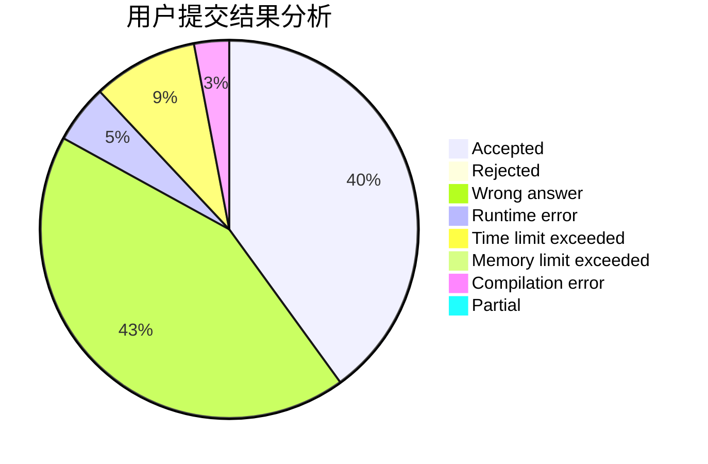
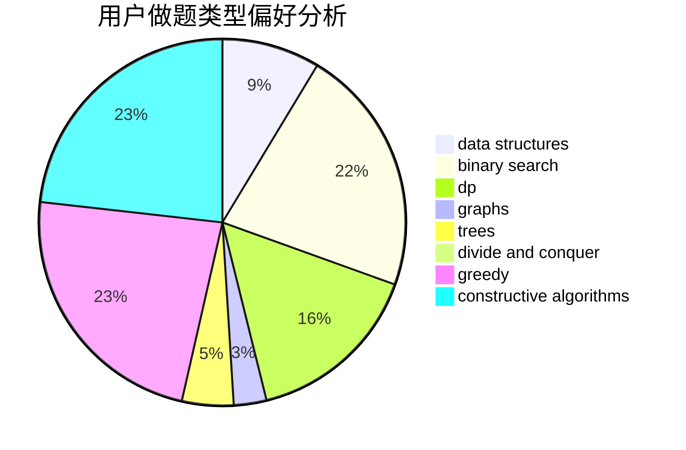
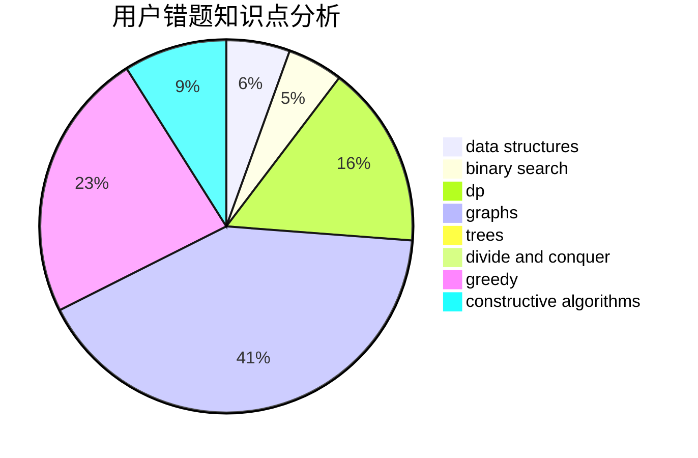

# BigWhiteRabbit

<!-- tabs:start -->

#### **用户提交结果分析**

#### **用户做题类型偏好分析**

#### **用户错题知识点分析**

<!-- tabs:end -->
# 推荐题目
[1468F](https://codeforces.com/contest/1468/problem/F)		geometry,
                        hashing,
                        number theory		  
[1146C](https://codeforces.com/contest/1146/problem/C)		bitmasks,
                        graphs,
                        interactive		  
[1325E](https://codeforces.com/contest/1325/problem/E)		brute force,
                        dfs and similar,
                        graphs,
                        number theory,
                        shortest paths		  
[1058B](https://codeforces.com/contest/1058/problem/B)		dsu,graphs,sortings,trees		  
[1158D](https://codeforces.com/contest/1158/problem/D)		constructive algorithms,
                        geometry,
                        greedy,
                        math		  
[1138C](https://codeforces.com/contest/1138/problem/C)		dsu,graphs,sortings,trees		  
[529B](https://codeforces.com/contest/529/problem/B)		brute force,
                        greedy,
                        sortings		  
[52B](https://codeforces.com/contest/52/problem/B)		combinatorics		  
[528A](https://codeforces.com/contest/528/problem/A)		dsu,graphs,sortings,trees		  
[1338E](https://codeforces.com/contest/1338/problem/E)		graphs		  
