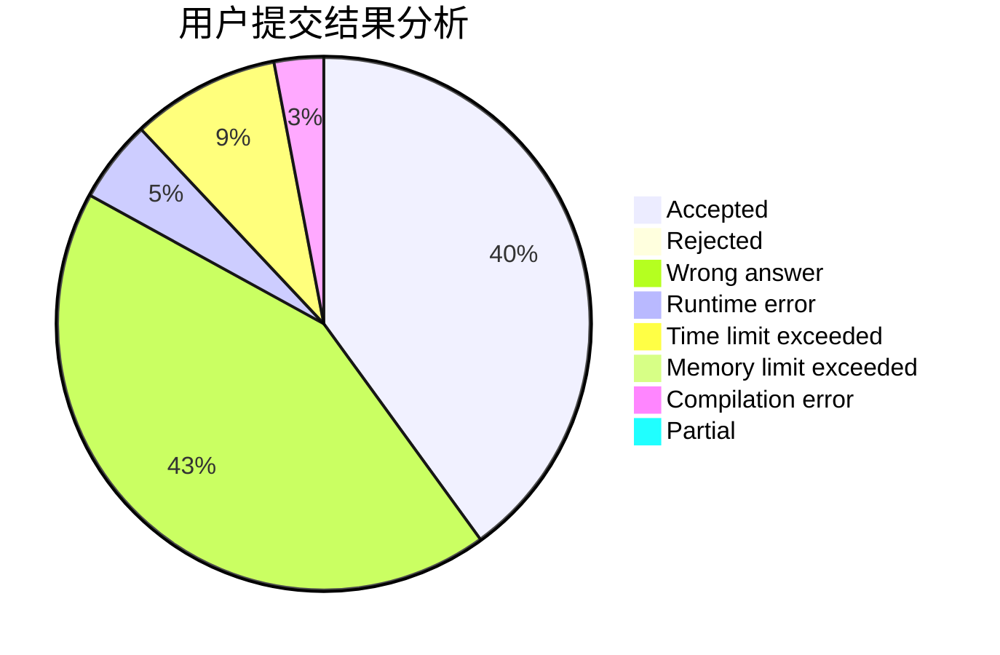
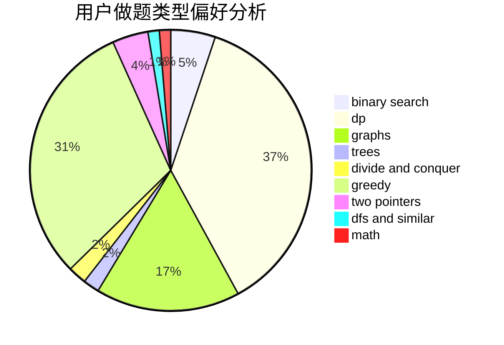

# BigWhiteRabbit

<!-- tabs:start -->

#### **用户提交结果分析**

#### **用户做题类型偏好分析**

<!-- tabs:end -->
# 推荐题目
[1475G](https://codeforces.com/contest/1475/problem/G)
[1148C](https://codeforces.com/contest/1148/problem/C)
[1332A](https://codeforces.com/contest/1332/problem/A)
[1058E](https://codeforces.com/contest/1058/problem/E)
[1161C](https://codeforces.com/contest/1161/problem/C)
[1140A](https://codeforces.com/contest/1140/problem/A)
[553A](https://codeforces.com/contest/553/problem/A)
[553C](https://codeforces.com/contest/553/problem/C)
[552A](https://codeforces.com/contest/552/problem/A)
[1345F](https://codeforces.com/contest/1345/problem/F)
