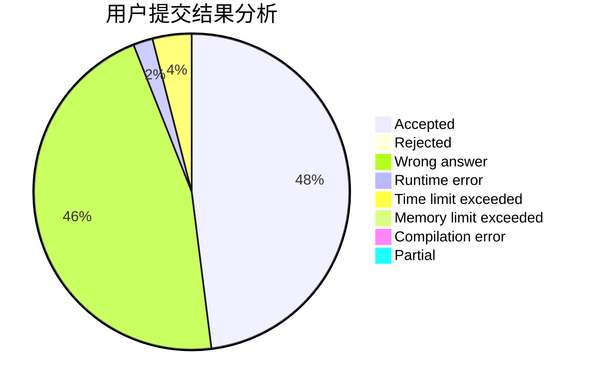
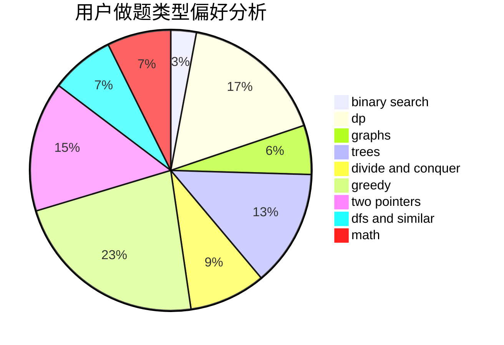

# li0201

<!-- tabs:start -->

#### **用户提交结果分析**

#### **用户做题类型偏好分析**

<!-- tabs:end -->
# 推荐题目
[667B](https://codeforces.com/contest/667/problem/B)
[740A](https://codeforces.com/contest/740/problem/A)
[616A](https://codeforces.com/contest/616/problem/A)
[571C](https://codeforces.com/contest/571/problem/C)
[505C](https://codeforces.com/contest/505/problem/C)
[802A](https://codeforces.com/contest/802/problem/A)
[765C](https://codeforces.com/contest/765/problem/C)
[672D](https://codeforces.com/contest/672/problem/D)
[208D](https://codeforces.com/contest/208/problem/D)
[1061E](https://codeforces.com/contest/1061/problem/E)
