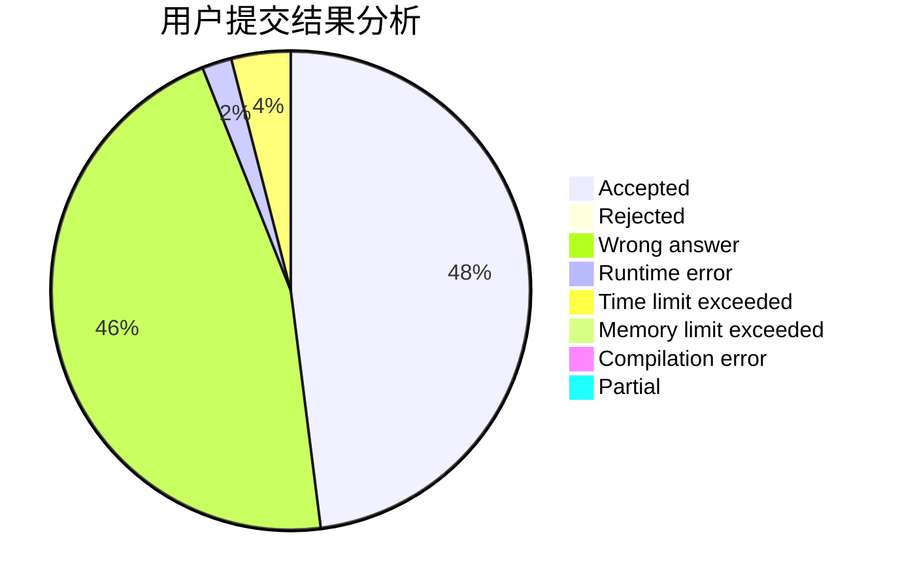
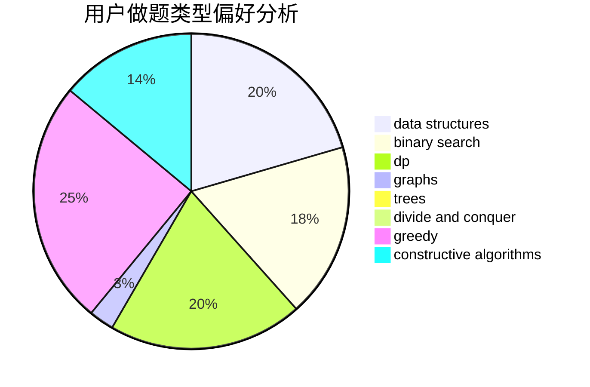
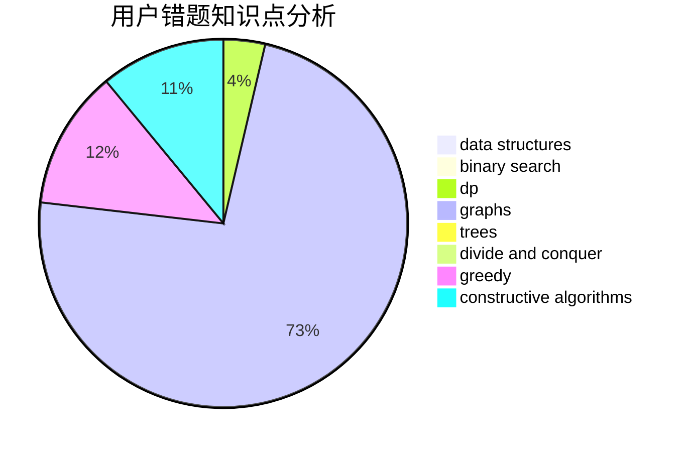

# li0201

<!-- tabs:start -->

#### **用户提交结果分析**

#### **用户做题类型偏好分析**

#### **用户错题知识点分析**

<!-- tabs:end -->
# 推荐题目
[634F](https://codeforces.com/contest/634/problem/F)		dsu,graphs,sortings,trees		  
[723B](https://codeforces.com/contest/723/problem/B)		expression parsing,
                        implementation,
                        strings		  
[598B](https://codeforces.com/contest/598/problem/B)		implementation,
                        strings		  
[547A](https://codeforces.com/contest/547/problem/A)		brute force,
                        greedy,
                        implementation,
                        math		  
[484B](https://codeforces.com/contest/484/problem/B)		binary search,
                        math,
                        sortings,
                        two pointers		  
[784E](https://codeforces.com/contest/784/problem/E)		*special problem,
                        brute force,
                        implementation		  
[746A](https://codeforces.com/contest/746/problem/A)		implementation,
                        math		  
[650A](https://codeforces.com/contest/650/problem/A)		data structures,
                        geometry,
                        math		  
[181B](https://codeforces.com/contest/181/problem/B)		binary search,
                        brute force		  
[1061A](https://codeforces.com/contest/1061/problem/A)		greedy,
                        implementation,
                        math		  
