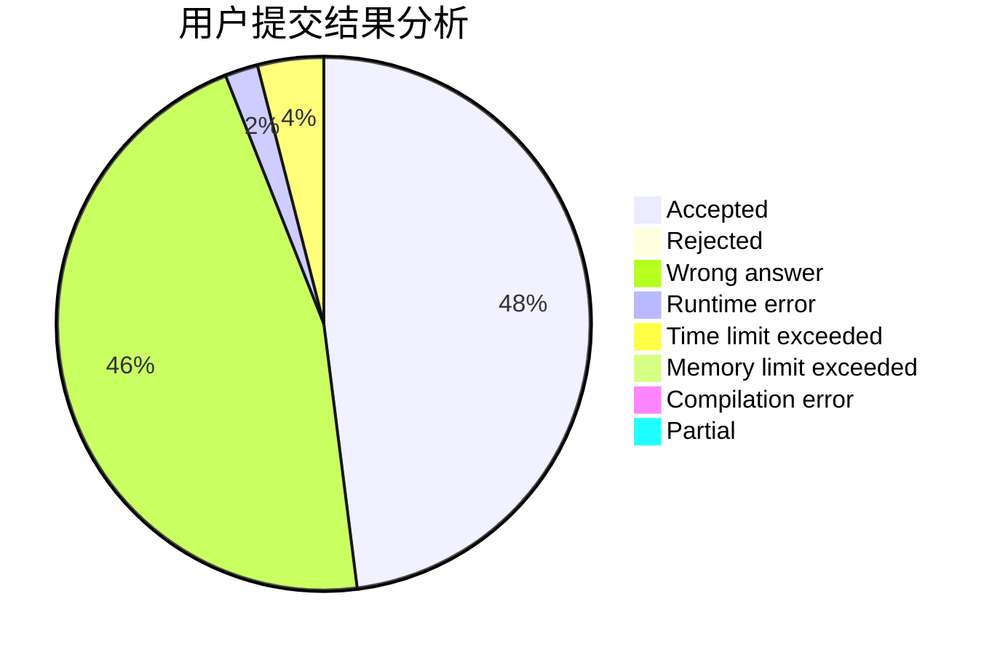
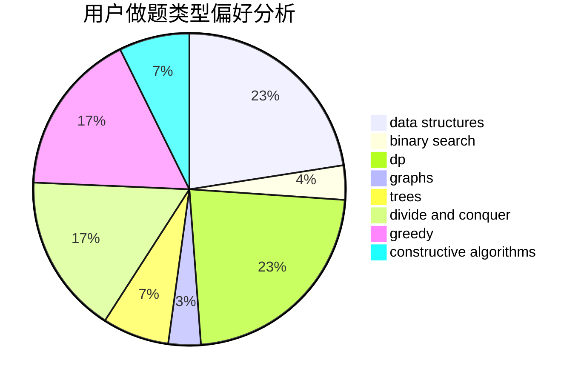
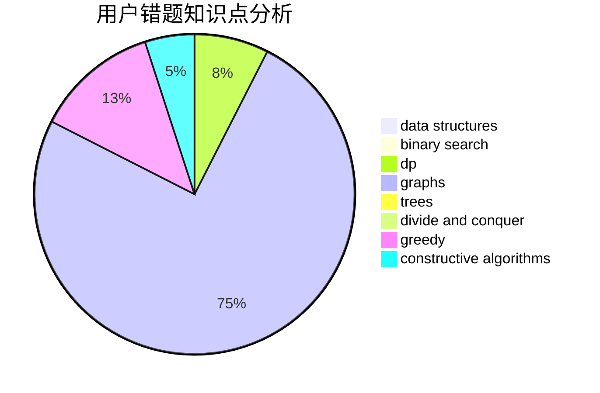

# li0201

<!-- tabs:start -->

#### **用户提交结果分析**

#### **用户做题类型偏好分析**

#### **用户错题知识点分析**

<!-- tabs:end -->
# 推荐题目
[667B](https://codeforces.com/contest/667/problem/B)		constructive algorithms,
                        geometry		  
[740A](https://codeforces.com/contest/740/problem/A)		brute force,
                        implementation		  
[616A](https://codeforces.com/contest/616/problem/A)		implementation,
                        strings		  
[571C](https://codeforces.com/contest/571/problem/C)		constructive algorithms,
                        dfs and similar,
                        graphs,
                        greedy		  
[505C](https://codeforces.com/contest/505/problem/C)		dfs and similar,
                        dp,
                        two pointers		  
[802A](https://codeforces.com/contest/802/problem/A)		greedy		  
[765C](https://codeforces.com/contest/765/problem/C)		math		  
[672D](https://codeforces.com/contest/672/problem/D)		dsu,graphs,sortings,trees		  
[208D](https://codeforces.com/contest/208/problem/D)		implementation		  
[1061E](https://codeforces.com/contest/1061/problem/E)		flows,
                        graphs		  
