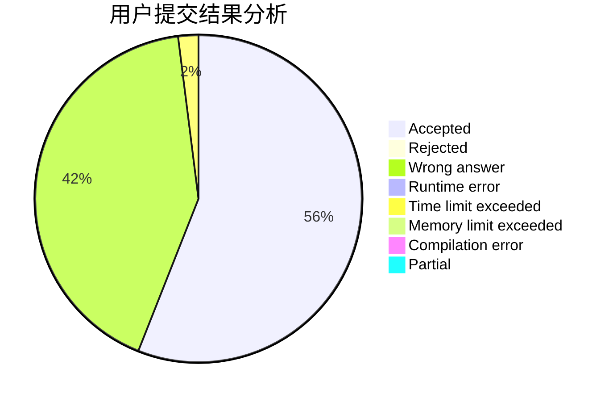
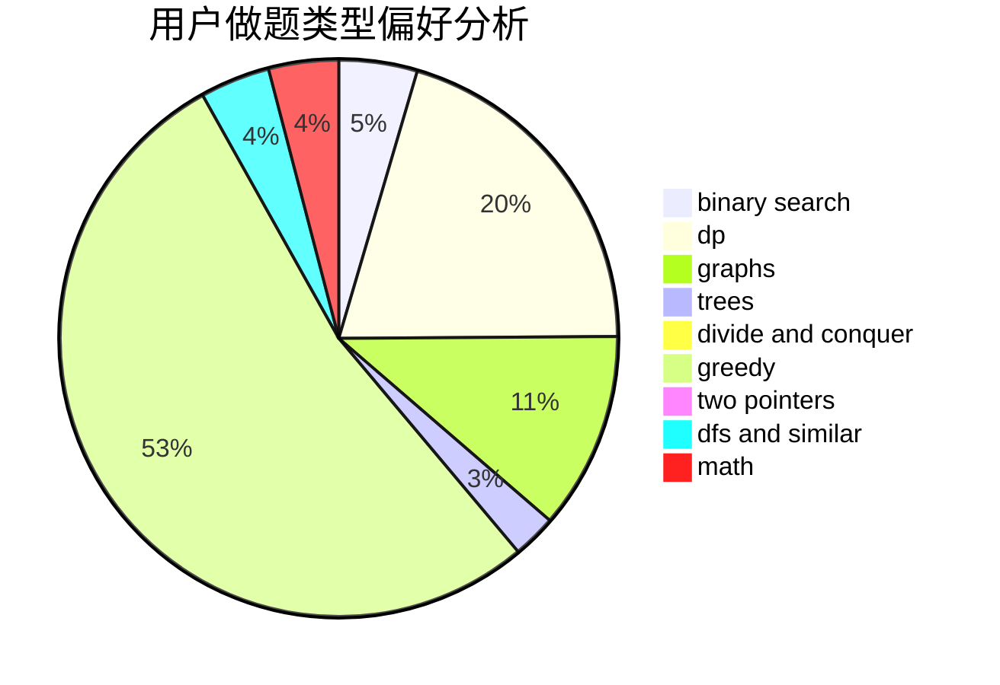

# li_z

<!-- tabs:start -->

#### **用户提交结果分析**

#### **用户做题类型偏好分析**

<!-- tabs:end -->
# 推荐题目
[1254A](https://codeforces.com/contest/1254/problem/A)
[13764](https://codeforces.com/contest/1376/problem/4)
[304C](https://codeforces.com/contest/304/problem/C)
[981G](https://codeforces.com/contest/981/problem/G)
[1423J](https://codeforces.com/contest/1423/problem/J)
[439D](https://codeforces.com/contest/439/problem/D)
[535B](https://codeforces.com/contest/535/problem/B)
[452B](https://codeforces.com/contest/452/problem/B)
[790A](https://codeforces.com/contest/790/problem/A)
[1070F](https://codeforces.com/contest/1070/problem/F)
