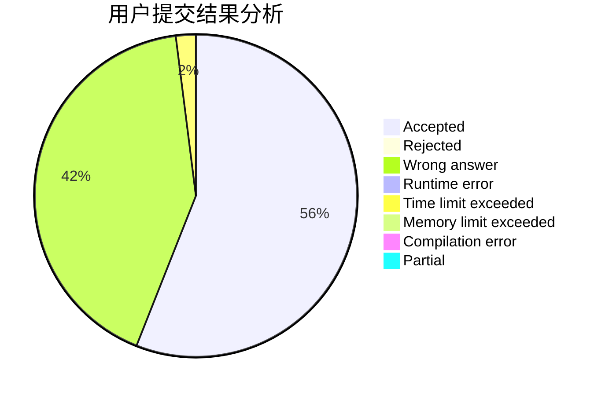
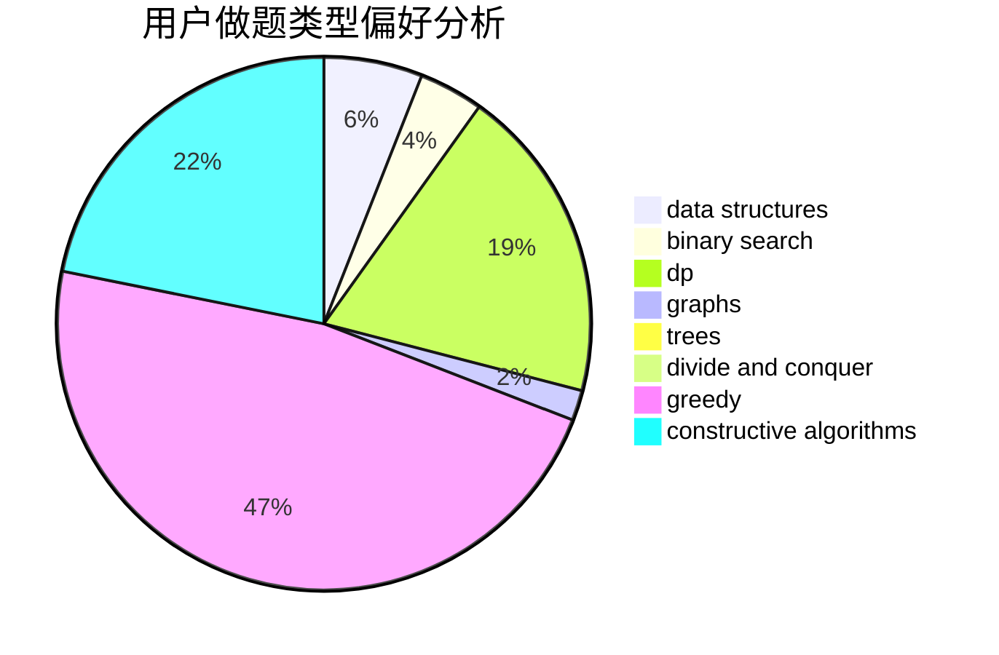
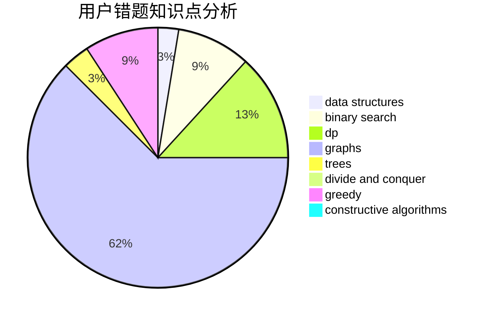

# li_z

<!-- tabs:start -->

#### **用户提交结果分析**

#### **用户做题类型偏好分析**

#### **用户错题知识点分析**

<!-- tabs:end -->
# 推荐题目
[1254A](https://codeforces.com/contest/1254/problem/A)		constructive algorithms,
                        greedy,
                        implementation		  
[13764](https://codeforces.com/contest/1376/problem/4)		dsu,graphs,sortings,trees		  
[304C](https://codeforces.com/contest/304/problem/C)		dsu,graphs,sortings,trees		  
[981G](https://codeforces.com/contest/981/problem/G)		data structures		  
[1423J](https://codeforces.com/contest/1423/problem/J)		bitmasks,
                        constructive algorithms,
                        dp,
                        math		  
[439D](https://codeforces.com/contest/439/problem/D)		binary search,
                        sortings,
                        ternary search,
                        two pointers		  
[535B](https://codeforces.com/contest/535/problem/B)		bitmasks,
                        brute force,
                        combinatorics,
                        implementation		  
[452B](https://codeforces.com/contest/452/problem/B)		brute force,
                        constructive algorithms,
                        geometry,
                        trees		  
[790A](https://codeforces.com/contest/790/problem/A)		dsu,graphs,sortings,trees		  
[1070F](https://codeforces.com/contest/1070/problem/F)		greedy		  
